# **Best practices for project organization and version control**

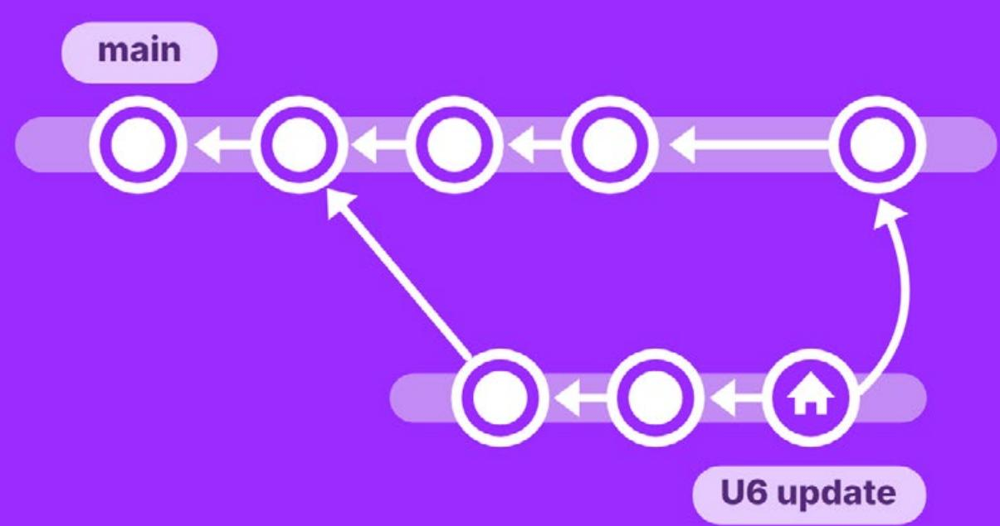


© 2024 Unity Technologies

## **Contents**

| Introduction 5                                   |
|--------------------------------------------------|
| Source control vs version control 6              |
| Foundational concepts 7                          |
| How version control works 7                      |
| Why use version control? 8                       |
| Centralized vs distributed version control 8     |
| Centralized 8                                    |
| Distributed 9                                    |
| Centralized 10                                   |
| Distributed 10                                   |
| Key terms 11                                     |
| Best practices for organizing a Unity project 13 |
| Project organization 13                          |
| Folder structure 13                              |
| Empty folders 19                                 |
| The .meta file 20                                |
| Naming standards 21                              |
| Workflow optimization 22                         |
| Split up your assets 22                          |
| Presets 23                                       |

| Code standards 24                                |
|--------------------------------------------------|
| UI Toolkit formatting conventions 27             |
| Services for project organization 27             |
| Asset Manager 27                                 |
| Build Automation 31                              |
| Version control systems 36                       |
| Git 36                                           |
| Perforce (Helix Core) 41                         |
| Apache Subversion 42                             |
| Unity Version Control 42                         |
| VCS comparison 45                                |
| Setting up Unity to work with version control 46 |
| Editor project settings 46                       |
| Perforce Helix Core 46                           |
| UVCS 48                                          |
| Git and other solutions 50                       |
| What to ignore 50                                |
| Working with large files 51                      |
| Best practices for version control 53            |
| Commit little, commit often 53                   |
| Keep commit messages clean 54                    |
| Avoid indiscriminate commits 54                  |
| Get the latest 55                                |
| Know your toolset 57                             |
| Feature branches and Git Flow 58                 |
| Pull requests 60                                 |
| Get started with UVCS in Unity 6 62              |

| Use UVCS in a Unity project 63             |  |
|--------------------------------------------|--|
| Inviting other team members 65             |  |
| Check in Changes 67                        |  |
| The UVCS desktop client 69                 |  |
| Using Gluon 71                             |  |
| UVCS desktop app 74                        |  |
| Branches 74                                |  |
| Handling conflicts 77                      |  |
| Merge rules 79                             |  |
| Locking files84                            |  |
| Monitoring or removing a repository 87     |  |
| Unity support 89                           |  |
| Build the foundation for your live game 90 |  |
|                                            |  |
| Unity Gaming Services 90                   |  |
| Multiplayer 90                             |  |
| Community 91                               |  |
| Accounts 91                                |  |
| Content management 91                      |  |
| Crash reporting 92                         |  |
| Game economy 92                            |  |
| Engagement and analytics 92                |  |
| Unity Grow 93                              |  |
| User acquisition 93                        |  |
| Monetization93                             |  |
| Conclusion 94                              |  |

## <span id="page-4-0"></span>Introduction

Software development becomes a different beast when you move from working on your own to with a team. Where do you store the project so that every team member has access to it? What happens if more than one person works on the same file at the same time? Programmers often understand the concepts behind source control, but what about artists and other non-technical team members? How can you minimize the amount of support they need from programmers, so they don't have to worry about doing something wrong?

Source control, or version control, can be a daunting topic for game developers, especially if you're not from a technical background. But it doesn't need to be that way. There are a number of tools that integrate with Unity to help your team work effectively with versioning.

This guide explains the key concepts of version control, compares some of the different version control systems (VCS) available, and provides an introduction to additional Unity DevOps tools like Unity Asset Manager, engagement and analytics, game economy, multiplayer services, and more. It provides tips and tricks you can use when setting up your Unity project to help ensure team collaboration is smooth and efficient. Finally, you'll pick up some version control best practices for working successfully in a team.

## <span id="page-5-0"></span>Source control vs version control

In the beginning of computing, all software development was pure code. Even as 3D graphics evolved, everything was still described as code. As such, the term "source control" was used to describe the systems in place to manage the project's contents, while the term source code management, or SCM, was given as a label for those tools.

Moving into the modern era of software and game development, we now work with a lot more than just the source code. 3D model formats, such as FBX, textures, materials, audio files, and more, mean that SCMs now have to handle more than just text file changes. The term "source control" no longer covers what we need, and thus "version control system" or VCS, became a more apt description and is now the common label given to the tools used.

The terms can still be used interchangeably. However, when talking about Unity projects that often deal with large binary assets, version control and VCS are most accurate, so that's how they'll be referred to throughout the rest of the guide.

Three of the main version control systems that work best with Unity are Unity Version Control (UVCS), (formerly known as Plastic SCM),<sup>1</sup> Git, and Perforce Helix Core. This guide presents the benefits and shortcomings of these systems when working as a team on a Unity project.

<sup>1</sup> Plastic SCM [joined](https://blog.plasticscm.com/2020/08/codice-software-is-now-part-of-unity.html) the Unity family in 2020, which means that these tools are closely integrated into the Unity Editor.

## <span id="page-6-0"></span>Foundational concepts

This section covers some of the core concepts of version control. If you don't know your "commit" from your "push", this section will help you understand version control terminology.

### How version control works

Version control allows you to keep a historical record of your entire project. It brings organization to your work and enables teams to iterate efficiently.

Project files are stored in a shared database called a repository, or "repo." You backup your project at regular intervals to the repo, and if something goes wrong, you can revert back to an earlier version of the project.

With a VCS, you can make multiple individual changes and commit them as a single group for versioning. This commit sits as a point on the timeline of your project, so that if you need to revert back to a previous version, everything from that commit is undone and restored to the state it was at the time. You can review and modify each change grouped within a commit or undo the commit entirely.

With access to the project's entire history, it's easier to identify which changes introduced bugs, restore previously removed features, and easily document changes between your game or product releases.

What's more, because version control is typically stored in the cloud or on a distributed server, it supports your development team's collaboration from wherever they're working – an increasingly important benefit as remote work becomes commonplace.

<span id="page-7-0"></span>

## Why use version control?

Aside from the reasons mentioned above, version control is useful for making experimental changes. You can add a new feature in your local version of the project, and if things don't work out, you just revert your changes to go back to working on a clean, functional version of the project.

You can iterate on experimental ideas, and if you need to help out on a major issue in the main project, version control allows you to save your changes for a later date. Then you can get your local version back to the main branch to help out with whatever needs to be worked on. Once you're done, you can restore and carry on with the experimental work.

Most version control systems prevent you from accidentally overwriting work that someone else in your team has done. As you commit your work to the repository, you will also need to "pull" the latest updates from the repository. This allows you to check that someone else hasn't been working on the same file as you. This is also known as the dreaded "merge conflict," one of the things that can be scary to people who are not used to version control. However, merge conflicts can usually be resolved easily once you understand the tools. Unity Version Control (UVCS) uses smart locks which helps to reduce the risk of merge conflicts by checking to ensure that locked files on any branch are the latest revision of that file.

## Centralized vs distributed version control

For the most part, version control systems fall into one of two categories: centralized or distributed. Depending on which kind of version control system you work with, some of the terms outlined below will apply, some won't, and some may even have a different meaning. Let's take a look at the differences between these two categories.

#### **Centralized**

The first key difference between centralized and distributed systems is where the repo resides. Many companies choose the centralized option to keep the servers hosting their proprietary software on-site. Source control security is often an important factor in choosing this kind of system. A centralized system doesn't have to mean on-site servers since the repo can still be hosted in the cloud, but this setup is less common than in distributed systems.

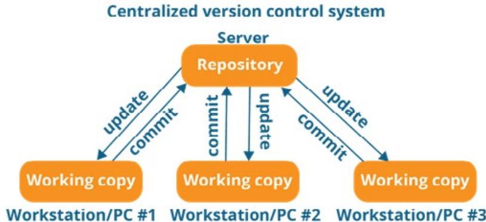

<span id="page-8-0"></span>

The other key difference between the two approaches is *how* users deploy their changes to the repo. Centralized version control is often seen as the more straightforward option. When working with a centralized repo, changes are fetched from and sent to the repository directly. This process is called updating from and committing to the repo.

The downside to this setup is that users must be connected to the server to submit any work. To avoid conflicts, users can lock files for modification. This is known as checking out the file, and it prevents anyone else from committing changes until the file is checked back in.

In a centralized workflow, a user only ever has the latest version of the project files on their workstation, and the server holds the project's entire history.

#### **Distributed**

In a distributed workflow, there is still a single location where the repo lives, usually on a cloud service such as GitHub, but users clone the entire project history to their workstation. This allows users to work on their own local copy and commit changes quickly since they don't need to be connected to a central server. To send those changes so others can access them later, the user needs to push them to the server and pull any other changes down. However, they don't need to be always working with the latest files like on a centralized system.

Working this way allows you to create a group of changesets that perhaps equate to a larger feature before pushing them up for the rest of your team. In fact, it's encouraged to commit little and often, but we will get to those best practices later on.

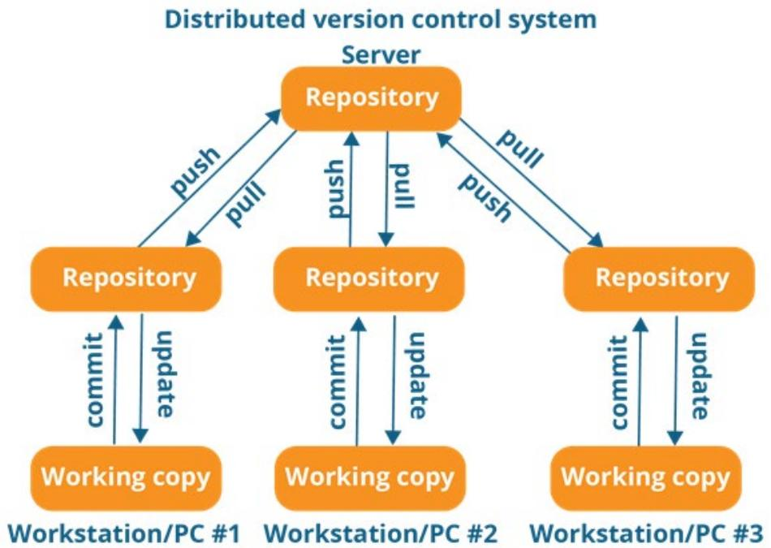

<span id="page-9-0"></span>

File locking is still available in some distributed workflows, however, it's less common since you can handle merges more easily. By pulling the latest changes from the server to your local project, you can compare anyone else's changes to your own to be sure there are no conflicts before pushing your changes to the repo.

While the distributed approach is often preferred, it also has a few disadvantages. Firstly, having the entire project history on local machines takes up a lot of space, especially for teams working with binary file types. Git has an option called Large File Storage (LFS), which converts the history of certain files to text pointers, offloading some of the weight. However, other files have the entire history, and repos can end up with a load of old or stale test data. Studios working with small M2 drives may then find the size of the repo gets bloated with old versions, overloading their drives.

Secondly, as developers don't have to stay in contact with a central server, they can end up working in isolation for long periods. Their local version can become quite detached from the main repository, and when it comes time to merge their changes back in, this may be more work than they bargained for.

#### **Typical workflow**

In brief, here are the steps in a workflow for a centralized system and a distributed one:

#### Centralized

- 1. Update your working copy with changes from the server.
- 2. Make your changes.
- 3. Commit your changes to the central server.
- Distributed
- 1. Pull any remote changes into your local repo.
- 2. Make your changes.
- 3. Commit your changes.
- 4. Perform steps 2 and 3 as many times as you like.
- 5. Push all commits back to the remote repo.

This guide focuses on three main version control systems: UVCS, Git, and Perforce Helix Core. A detailed walkthrough of each VCS starts in the section ["Version control systems](#page-37-0)", but here's a brief introduction to each one and the workflow it supports:

- [Unity Version Control](https://unity.com/solutions/version-control) or UVCS (both): UVCS is a flexible version control system with unique interfaces to support programmers and artists alike. It excels at handling large repos and binary files, and as both a file-based and changeset-based solution, it gives you the capability to download only the specific files you're working on, rather than the entire project build.
- [Git](https://git-scm.com/) (distributed): This is one of the most popular version control systems around. Git is open source, free, and flexible. As a platform Git is a command line-only tool. But many different GUIs have been developed for it, making the system more accessible to users.

<span id="page-10-0"></span>

There can often be some confusion between Git and [GitHub](https://github.com/). GitHub is a hosting service for Git repositories, but you can use Git without using GitHub. That said, as any experienced developer reading this will know, GitHub is a very popular service because there is a free version (with some limitations), and it doesn't require any custom server setups.

— [Perforce Helix Core](https://www.perforce.com/products/helix-core) (centralized): This is an enterprise-level version control system generally used by large game studios because it features centralized repos that are most often hosted on their own servers.

### Key terms

Here are the terms for some of the key features and processes in a VCS:

| Term                  | Explanation                                                                                                                                                                                                                                           |
|-----------------------|-------------------------------------------------------------------------------------------------------------------------------------------------------------------------------------------------------------------------------------------------------|
| Repository/repo       | This is the database of all the changes and edits to your project.<br>Stored on a server, either on-site or in the cloud, it holds the full<br>history of the project.                                                                                |
| Working copy          | This is your local version of the project. Sometimes also called<br>a checkout or workspace. You make changes to your working<br>copy, and, when you're happy with them, commit them to the<br>repository.                                            |
| Commit/check in       | A commit encodes file modifications. A centralized workflow<br>sends those changes to the server and is more commonly<br>called checking in. In a distributed workflow, it adds them to the<br>changeset that needs to later be pushed to the server. |
| Pull/update/check out | Pulling or updating retrieves the latest changes available on the<br>server. Check out is the more common term when working in a<br>centralized workflow.                                                                                             |
| Locking               | Locking a file prevents it from being edited by another user. You<br>are telling the server, "I'm working on this; please don't make any<br>other changes." Locking is generally not supported in distributed<br>workflows.                           |
| Clone                 | In a distributed workflow, cloning a repo is how you initially get a<br>copy of the project and its entire history onto your local machine.                                                                                                           |
| Tags                  | Tags are special notes that can be added to a commit. They are<br>often used to mark a point in time where a build was made.                                                                                                                          |
| Branch                | A branch creates a new copy of the codeline, which can then<br>be worked on in parallel. This allows someone to work on parts<br>of the project in isolation, for example a new feature, without<br>affecting the main line of development.           |


| Merge        | Merging can happen either when a branch is finished and needs<br>to be merged back into the main line, or even just when two<br>people make changes around the same time. The two changesets<br>will need to be compared and merged together to create the new<br>working copy. Most merges can be handled automatically.                           |
|--------------|-----------------------------------------------------------------------------------------------------------------------------------------------------------------------------------------------------------------------------------------------------------------------------------------------------------------------------------------------------|
|              | A conflict is what happens when merges cannot be handled<br>automatically. This usually occurs when two people have made<br>changes to the same lines of code or the same binary file.                                                                                                                                                              |
| Conflict     | Code conflicts can usually be resolved by comparing the text and<br>working out which changes should be accepted, or even whether<br>both can be brought together in a way.                                                                                                                                                                         |
|              | For binary files, such as Unity scenes or Prefabs, merging a<br>conflict becomes a lot trickier. However, sometimes a quick<br>conversation with the other contributor is the easiest way to<br>resolve what changes make the most sense to keep.                                                                                                   |
| Pull request | When work on a branch is complete, it's good practice to open<br>a pull request. This signals to the rest of your team that work on<br>that branch is complete and ready to be merged back into the<br>main line. This system gives team leads and/or seniors a chance<br>to review the changes before accepting them back into the main<br>branch. |
| Head         | Head refers to the latest commit on your working copy.                                                                                                                                                                                                                                                                                              |
| Reset/revert | Depending on your VCS, reset or revert can be used to discard all<br>your local changes back to their state at the head.                                                                                                                                                                                                                            |
| Index        | The Git index is a file that describes all the current changes you<br>have in your working copy. These changes sit in what's known as<br>the staging area, where you can select which changes you want<br>to add to your next commit.                                                                                                               |
| Git stash    | If you have some changes that aren't ready yet for a commit, but<br>you need to move onto some different work, you can use a stash<br>to save those changes in a temporary file and reset your working<br>copy back to head.                                                                                                                        |

## <span id="page-12-0"></span>Best practices for organizing a Unity project

Regardless of which VCS you choose, there are some generally recommended practices that will help streamline your version control workflow when working in Unity. First, let's take a look at some of the different ways your team can work together effectively.

## Project organization

#### **Folder structure**

Although there is no single way to organize your project, in general, follow these recommendations.

- Define and document your naming conventions and folder structure as a team. A style guide and/or project template makes your files easier to find and organize. Pick what works for your team, and make sure everyone is on board with it.
- Be consistent with your naming convention. Don't deviate from your chosen style guide or template. If you do need to amend your naming rules, parse and rename your affected assets all at once. In cases where the changes affect a large number of files, consider automating the update using a script.
- Don't use spaces in file and folder names. Use CamelCase as an alternative for spaces.
- Separate testing or sandbox areas. Create a separate folder for non-production scenes and experimentation. Subfolders with usernames can divide your work area by team member.
- Avoid extra folders at the root level. In general, store your content files within the Assets folder. Don't create additional folders at the project's root level unless it's absolutely necessary.


— Keep your internal assets separate from third-party ones. If you are using assets from the Asset Store or other plug-ins, odds are they have their own project structure. Keep your assets separate.

If you find yourself modifying a third-party asset or plug-in for your project, then version control can really help you out when you need to get the latest update for the plug-in. Once the update is imported, you can look through the diff to find where your modifications may have been overwritten and reimplement them.

While there is no set folder structure, here are a couple of examples of how you might set up your Unity project. These structures are based on splitting up your project by asset type. The [Asset Types](https://docs.unity3d.com/6000.0/Documentation/Manual/AssetTypes.html) manual page describes the most common assets in greater detail. You can use the Template or Learn projects as an example of organizing your folder structure. While you're not limited to these folder names, they should give you a good starting point.

#### **Example 1**

| Assets                                                  |
|---------------------------------------------------------|
| +---Art                                                 |
| +---Materials                                           |
| +---Models                                              |
| +---Textures                                            |
| +---Audio                                               |
| +---Music                                               |
| \---Sound                                               |
| +---Code                                                |
| +---Scripts # C# scripts                                |
| \---Shaders # Shader files and shader graphs            |
| +---Docs<br># Wiki, concept art, marketing material     |
| +---Level<br># Anything related to game design in Unity |
| +---Prefabs                                             |
| +---Scenes                                              |
| \---UI                                                  |


| Example 2     |
|---------------|
| Assets        |
| +---Art       |
| +---Materials |
| +---Models    |
| +---Music     |
| +---Prefabs   |
| +---Sound     |
| +---Textures  |
| +---UI        |
| +---Levels    |
| +---Src       |
| +---Framework |
| \---Shaders   |

If you download one of the template or starter projects from the Unity Hub, you'll find that those projects have their subfolders split up based on asset type, as seen in the image below.

| Unity Hub 3.8.0  |                                           | - 0 ×                                                                                                                                                          |
|------------------|-------------------------------------------|----------------------------------------------------------------------------------------------------------------------------------------------------------------|
|                  | New project<br>Editor Version: 6000.0.5f1 |                                                                                                                                                                |
| II All templates | Q Search Sample templates                 |                                                                                                                                                                |
| Core<br>& Sample | Universal 3D sample<br>1<br>Sample        | 0                                                                                                                                                              |
| · Learring       | High Definition 3D sample<br>0<br>Sample  | 0<br>Universal 3D sample                                                                                                                                       |
|                  | VR Multiplayer<br>4<br>Sample             | These four environments showcase the<br>versatility, scalability, and customizability of the<br>0<br>Universal Render Pipeline (URP). The project<br>Read more |
|                  | Cinematic Studio<br>1<br>Sample           | 0<br>· Download template                                                                                                                                       |

Templates available to download in the Unity Hub

Depending on which template you've chosen, you should see subfolders that represent several common assets. Here is one way to organize by type:

| Animations | Animations contain animated motion clips and their controller files.<br>These can also contain Timeline assets for in-game cinematics or rigging<br>information for procedural animation. |  |
|------------|-------------------------------------------------------------------------------------------------------------------------------------------------------------------------------------------|--|
| Audio      | Sound assets include audio clips as well as the mixers used for blending the<br>effects and music.                                                                                        |  |
| Editor     | Here you'll find the scripted tools made for use with the Unity Editor but not<br>appearing in a target build.                                                                            |  |
| Fonts      | This folder contains the fonts used in the game.                                                                                                                                          |  |
| Materials  | These assets describe surface shading properties.                                                                                                                                         |  |

| Meshes     | Store models created in an external digital content creation (DCC)<br>application here.                                                                                                                                                                               |  |  |
|------------|-----------------------------------------------------------------------------------------------------------------------------------------------------------------------------------------------------------------------------------------------------------------------|--|--|
| Particles  | The particle simulations in Unity, created either with the Built-In Particle<br>System or Visual Effect Graph.                                                                                                                                                        |  |  |
| Prefabs    | These are reusable GameObjects with prebuilt Components.                                                                                                                                                                                                              |  |  |
| Scripts    | All user-developed code for gameplay appears here.                                                                                                                                                                                                                    |  |  |
| Scenes     | Unity stores small, functional portions of your project into Scene assets.<br>They often correspond to game levels or part of a level.                                                                                                                                |  |  |
| Settings   | This can be used for storing render pipeline settings, such as for the High<br>Definition Render Pipeline (HDRP) and Universal Render Pipeline (URP).                                                                                                                 |  |  |
| Shaders    | These programs run on the GPU as part of the graphics pipeline.                                                                                                                                                                                                       |  |  |
| Textures   | Image files can consist of texture files for materials and surfacing, UI<br>overlay elements for user interface, and lightmaps to store lighting<br>information.                                                                                                      |  |  |
| ThirdParty | If you have assets from an external source like the Asset Store, keep them<br>separated from the rest of your project here. This makes updating your<br>third-party assets and scripts easier.<br>Third-party assets may have a set structure that cannot be altered. |  |  |
| UI         | If you're using UI Toolkit, your UXML and USS files are stored here.                                                                                                                                                                                                  |  |  |

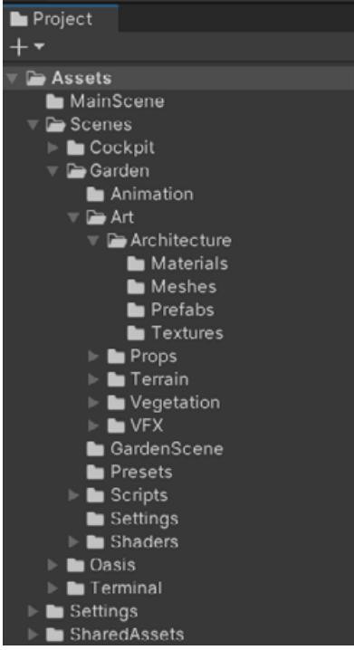

Defining a good project structure in the beginning will avoid version control issues later. If you move assets from one folder to another, many VCS will see that as just deleting one file and adding another, rather than the file being moved. This loses the history of the original file.

UVCS can handle file moves within Unity and maintains the history of any file that's moved. However, it's essential that when you move a file, you do it in the Unity Editor so that the .meta file moves with the asset file.

The sample scene with the URP template includes a number of asset folders.


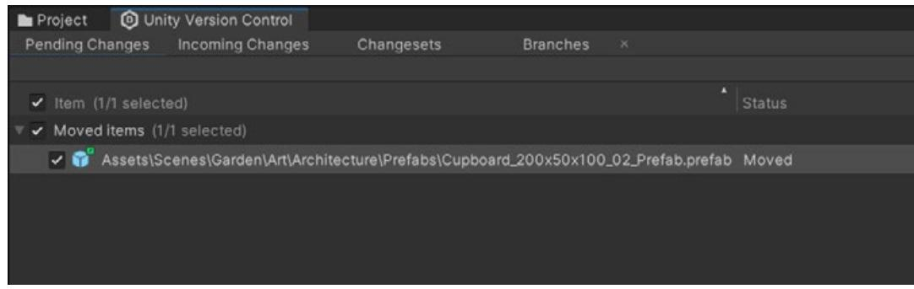

Tracking file movements

Once you've decided on a folder structure for your projects, use an Editor script to reuse the template and create the same folder structure for all projects moving forward. When it's placed in an Editor folder, the script below will create a root folder in Assets matching the "PROJECT\_ NAME" variable. Doing this keeps your own work separate from third-party packages.

```
using UnityEditor;
using UnityEngine;
using System.Collections.Generic;
using System.IO;
public class CreateFolders : EditorWindow {
 private static string projectName = "PROJECT_NAME";
 [MenuItem("Assets/Create Default Folders")]
 private static void SetUpFolders()
 {
 CreateFolders window = 
ScriptableObject.CreateInstance<CreateFolders>();
 window.position = new Rect(Screen.width/2, Screen.height/2, 400, 150);
 window.ShowPopup();
 }
 private static void CreateAllFolders()
 {
 List<string> folders = new List<string>
 {
 "Animations",
 "Audio",
 "Editor",
 "Materials",
 "Meshes",
 "Prefabs",
 "Scripts",
```


```
 "Scenes",
 "Shaders",
 "Textures",
 "UI" 
 };
 foreach (string folder in folders)
 {
 if (!Directory.Exists("Assets/" + folder))
 {
 Directory.CreateDirectory("Assets/" + projectName + "/" + folder);
 }
 }
 List<string> uiFolders = new List<string>
 {
 "Assets",
 "Fonts",
 "Icon"
 };
 foreach (string subfolder in uiFolders)
 {
 if (!Directory.Exists("Assets/" + projectName + "/UI/" + subfolder))
 {
 Directory.CreateDirectory("Assets/" + projectName + "/UI/" + subfolder);
 }
 }
 AssetDatabase.Refresh();
 }
 void OnGUI()
 {
 EditorGUILayout.LabelField("Insert the Project name used as the root folder");
 projectName = EditorGUILayout.TextField("Project Name: ",projectName);
 this.Repaint();
 GUILayout.Space(70);
 if (GUILayout.Button("Generate!")) {
 CreateAllFolders();
 this.Close();
 }
 }
}
```
<span id="page-18-0"></span>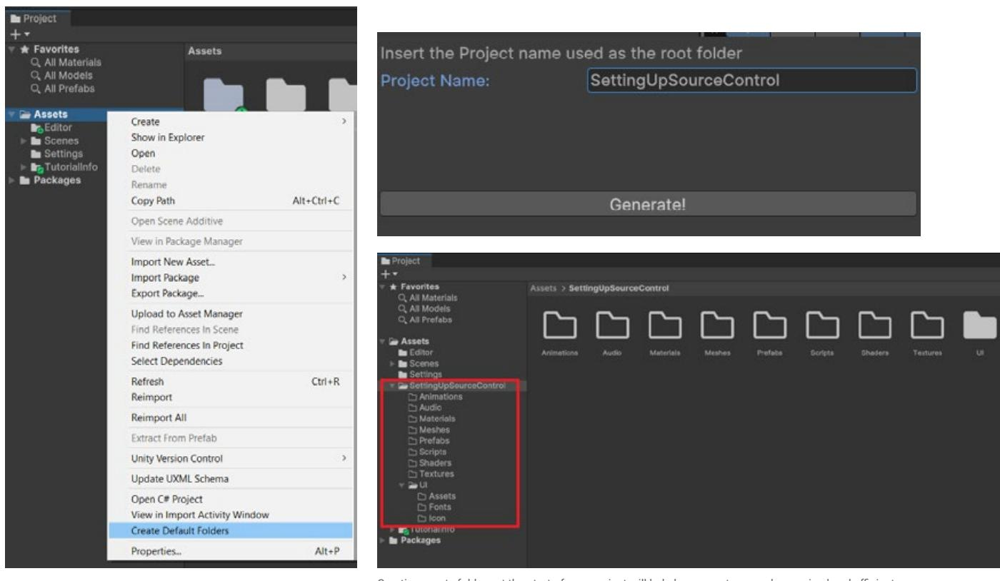

Go to menu > Assets > Create Default Folders. Creating empty folders at the start of your project will help keep your teamwork organized and efficient.

### **Empty folders**

Empty folders like those shown in the previous images can present a bit of an issue in version control – so only create the folders for what you need. With Git and Perforce, empty folders are ignored by default. If these project folders are set up and someone attempts to commit them, they'll be unable to until something is placed in the folder.

**Note**: A common workaround is to place a ".keep" file inside an empty folder. This is enough for the folder to then be committed to the repository.

UVCS can handle empty folders. Directories are treated as entities and have a version history associated with them.

This is a point to note when working in Unity. Unity generates a .meta file for every file in the project, including folders. With Git and Perforce, a user can easily commit the .meta file for an empty folder, but the folder itself won't end up under version control. When another user gets the latest changes, there will be a .meta file for a folder that doesn't exist on their machine, and Unity will then delete the .meta file. UVCS avoids this issue by including empty folders under version control.

<span id="page-19-0"></span>

#### **The .meta file**

Unity generates a .meta file for every other file inside the project, and while it's typically inadvisable to include auto-generated files in version control, the .meta file is a little different. Visible Meta Files mode should be turned on in the Version Control window (unless you're using UVCS or Perforce modes).

| Project Settings                                                       |                 |   |                    |     |    |
|------------------------------------------------------------------------|-----------------|---|--------------------|-----|----|
|                                                                        |                 | ್ |                    |     |    |
| Adaptive Performance<br>Audio<br>Burst AOT Settings                    | Version Control |   |                    | 0 元 | 15 |
| Editor<br>Graphies<br>Input Manager                                    | Mode            |   | Visible Meta Files |     | A  |
| Input System Package<br>Settings<br>Memory Settings<br>Package Manager |                 |   |                    |     |    |
| Physics<br>1<br>Settings<br>Physics 2D                                 |                 |   |                    |     |    |
| Player<br>Preset Manager<br>Quality<br>Scene Template                  |                 |   |                    |     |    |
| Script Execution Order<br>Services                                     |                 |   |                    |     |    |
| Unity Cloud<br>ShaderGraph                                             |                 |   |                    |     |    |
| Tags and Layers                                                        |                 |   |                    |     |    |
| TextMesh Pro                                                           |                 |   |                    |     |    |
| Time                                                                   |                 |   |                    |     |    |
| Timeline                                                               |                 |   |                    |     |    |
| Ul Toolkit<br>Version Control                                          |                 |   |                    |     |    |
| Unity Version Control Settings                                         |                 |   |                    |     |    |
| Visual Scripting                                                       |                 |   |                    |     |    |
| XR Plugin Management                                                   |                 |   |                    |     |    |

Turn on Visible Meta Files when working with Git.

While the .meta file is auto-generated, it also holds a lot of information about the file with which it's associated. This is common with assets that have import settings, such as Textures, meshes, audio clips, etc. When you change any import settings on these files, the changes are written into the .meta file, not the asset file. This is why you commit the .meta files to your repository, so everyone works with the same file settings.

<span id="page-20-0"></span>

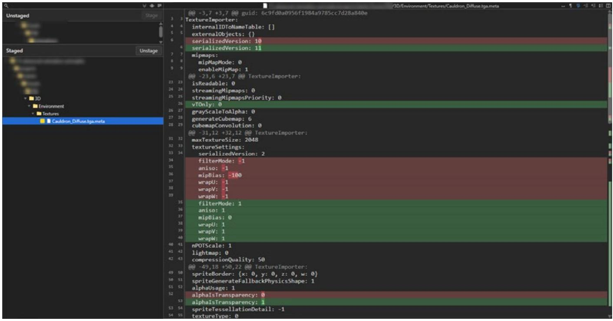

Changes to a .meta file when import settings were adjusted on a file

### **Naming standards**

Agreeing on standards doesn't stop with project folder structure. Setting a naming standard for GameObjects in a scene or prefabs inside project folders can make things easier for your team to understand when you end up working in one another's files.

Though there is no definitive naming standard for GameObjects, consider the following.

| Standard                                                                                                                                                                                                                                                                                                  | Example                                                                                     |
|-----------------------------------------------------------------------------------------------------------------------------------------------------------------------------------------------------------------------------------------------------------------------------------------------------------|---------------------------------------------------------------------------------------------|
| Use descriptive names and don't abbreviate.<br>Use names that you will remember several<br>months from now. Consider whether another<br>person will understand your notation, and choose<br>names that you can pronounce and remember.<br>For this reason abbreviations are generally not<br>recommended. | largeButton, LargeButton, or leftButton<br>NOT:<br>lButton                                  |
| Use Camel case/Pascal case.<br>Avoid spaces in your object names. Camel case<br>or Pascal case improve readability (and typing<br>accuracy according to this study).                                                                                                                                      | OutOfMemoryException,<br>dateTimeFormat,<br>NOT:<br>Outofmemoryexception,<br>datetimeformat |

<span id="page-21-0"></span>

|                                                                                                                                                                                                                                                                                                | Active States:                                                                                                    |
|------------------------------------------------------------------------------------------------------------------------------------------------------------------------------------------------------------------------------------------------------------------------------------------------|-------------------------------------------------------------------------------------------------------------------|
| Use underscores (or hyphens) sparingly. Avoid<br>underscores and hyphens in general. However,<br>they can be useful in certain circumstances.<br>Prefixing a name with an underscore puts it<br>alphabetically first. You can also use underscores<br>to denote variants of a specific object. | EnterButton_Active, EnterButton_<br>Inactive                                                                      |
|                                                                                                                                                                                                                                                                                                | Texture Maps:                                                                                                     |
|                                                                                                                                                                                                                                                                                                | Foliage_Diffuse, Foliage_Normalmap                                                                                |
|                                                                                                                                                                                                                                                                                                | Level of Detail:                                                                                                  |
|                                                                                                                                                                                                                                                                                                | Building_LOD1, Building_LOD0                                                                                      |
| Use number suffixes to denote a sequence.                                                                                                                                                                                                                                                      | For a path, name the nodes:                                                                                       |
| Likewise, don't suffix with a number if it's not<br>part of a list.                                                                                                                                                                                                                            | Node0, Node1, Node2, etc.                                                                                         |
| Follow the design document naming.                                                                                                                                                                                                                                                             | If your design document names<br>locations like HighSpellTower or<br>RedDragonLair, use those exact<br>spellings. |

Agreeing on a consistent style across your team can result in a cleaner, more readable and scalable project. The Unity e-book, *[Create a C# style guide: Write cleaner code that scales](https://unity.com/resources/create-code-c-sharp-style-guide-e-book?isGated=false)*, provides tips and best practices for naming conventions, formatting, classes, methods, comments and more. Overall the guide follows [Microsoft C# style standards 2](https://docs.microsoft.com/en-us/dotnet/csharp/fundamentals/coding-style/coding-conventions), providing a Unity-specific subset of that, but there is no one "true" method; the [Google C# 2](https://google.github.io/styleguide/csharp-style.html) guide is also a great resource for defining guidelines around naming, formatting, and commenting conventions.

#### **Workflow optimization**

Aside from how and where you keep your assets inside the Assets folder, there are several design and development choices you can make to help speed up your workflow, especially when you're using version control.

#### Split up your assets

Large, single Unity scenes do not lend themselves well to collaboration. Break your levels into many smaller scenes so that artists and designers can collaborate better on a single level while minimizing the risk of conflicts.

At runtime, your project can load scenes additively using SceneManager.LoadSceneAsync passing the LoadSceneMode.Additive parameter mode.

Additionally, break work up into Prefabs where possible. If you need to make changes later, you can change the Prefab rather than the scene it's used in to avoid conflicts with anyone working on the scene. Prefab changes can often be easier to read when doing a diff under version control.

<span id="page-22-0"></span>

And if you end up with a scene conflict, [Unity also has a built-in YAML](https://unity.com/blog/engine-platform/understanding-unitys-serialization-language-yaml) (a human-readable, data-serialization language) tool specifically for merging scenes and Prefabs. For more information, see [Smart merge](https://docs.unity3d.com/6000.0/Documentation/Manual/SmartMerge.html?) in the Unity documentation.

#### Presets

Unity presets are predefined configurations that allow you to save and reuse specific settings across different components, assets, or tools within a project. Creating a [Preset](https://docs.unity3d.com/6000.0/Documentation/Manual/Presets.html) lets you copy the settings of a component or asset, save it as an asset, then apply the same settings to another item later.

Use Presets to enforce standards or to apply reasonable defaults to new assets. This ensures consistent standards across your team, so commonly overlooked settings don't impact your project's performance.

| 1<br>Transform |     |     |    | 9 花 |
|----------------|-----|-----|----|-----|
| Position       | X 0 | Y O | ZO |     |
| Rotation       | X 0 | Y O | ZO |     |
| Scale          | ×1  | Y 1 | Z1 |     |

The Preset icon is highlighted here in red.

Click the Preset icon to the top right of the component. Click **Save current to…** to save the Preset as an asset. Click one of the available Presets to load a set of values.


In this example, the Presets contain different Import Settings for 2D textures depending on usage (albedo, normal, or utility).

<span id="page-23-0"></span>

Other handy ways to use Presets include:

- **Create a GameObject with defaults:** Drag and drop a Preset asset into the Hierarchy to create a new GameObject with the corresponding component that includes Preset values.
- **Associate a specific Type with a Preset:** In the Preset Manager (**Project Settings > Preset Manager**), specify one or more Presets per type. Creating a new component will then default to the specified Preset values.
	- Pro tip: Create multiple Presets per type, and rely on the filter to associate the correct Preset by name.
- **Save and load manager settings:** Use Presets for a Manager window so the settings can be reused. For example, if you plan to reapply the same tags and layers or physics settings, Presets can reduce setup time for your next project.

#### **Code standards**

Coding standards will also help keep your team's work consistent and make it easier for developers to swap between different areas of your project. Again, there are no set-in-stone rules here. You need to decide what is best for your team – but once you've decided, stick with it.

As an example, namespaces can help organize your code better. They allow you to separate modules inside your project and avoid conflicts with third-party assets where class names may end up repeating.

When using namespaces in your code, break your folder structure up by the namespace for better organization.

A standard header is also a good practice. Including a standard header in your code template will help to document the purpose of a class, the date it was created, and even *who* created it. All of this is information that could easily get lost in the long history of a project, even when using version control.

Unity employs a template script to read from whenever you create a new Monobehaviour in the project. Every time you create a new script or shader, Unity uses a template stored in **%EDITOR\_PATH%\Data\Resources\ScriptTemplates**:

- Windows: *C:\Program Files\Unity\Editor\Data\Resources\ScriptTemplates*
- Mac: */Applications/Hub/Editor/[version]/Unity/Unity.app/Contents/Resources/ ScriptTemplates*

The default Monobehaviour template is this one: **81-C# Script-NewBehaviourScript.cs.txt**


There are also templates for shaders, other behavior scripts, and assembly definitions.

For project-specific script templates, create an Assets/ScriptTemplates folder, and copy the script templates into this folder to override the defaults.

You can also modify the default script templates directly for all projects, but make sure you backup the originals before making any changes. Each version of Unity has its own template folder, so when you update to a new version, you need to replace the templates again.

The original 81-C# Script-NewBehaviourScript.cs.txt file looks like this:

```
using System.Collections;
using System.Collections.Generic;
using UnityEngine;
#ROOTNAMESPACEBEGIN#
public class #SCRIPTNAME# : MonoBehaviour
{
 // Start is called before the first frame update
 void Start()
 {
 #NOTRIM#
 }
 // Update is called once per frame
 void Update()
 {
 #NOTRIM#
 }
}
#ROOTNAMESPACEEND#
```
There are two keywords that may be helpful:

- **#SCRIPTNAME#** indicates the filename entered or the default filename (for example, NewBehaviourScript).
- **#NOTRIM#** ensures that the brackets contain a line of whitespace.

You can also use your own keywords and replace them with an Editor script implementing the OnWillCreateAsset method.


```
// /*-------------------------------------------
// ---------------------------------------------
// Creation Date: #DATETIME#
// Author: #DEVELOPER#
// Description: #PROJECTNAME#
// ---------------------------------------------
// -------------------------------------------*/
using UnityEngine;
using UnityEditor;
public class KeywordReplace : UnityEditor.AssetModificationProcessor {
 public static void OnWillCreateAsset (string path)
 {
 path = path.Replace(".meta", "");
 int index = path.LastIndexOf(".");
 if (index < 0)
 return;
 string file = path.Substring(index);
 if (file != ".cs" && file != ".js" && file != ".boo")
 return;
 index = Application.dataPath.LastIndexOf("Assets");
 path = Application.dataPath.Substring(0, index) + path;
 if (!System.IO.File.Exists(path))
 return;
 string fileContent = System.IO.File.ReadAllText(path);
 fileContent = fileContent.Replace("#CREATIONDATE#", System.DateTime.Today.ToString("dd/MM/
yy") + "");
 fileContent = fileContent.Replace("#PROJECTNAME#", PlayerSettings.productName);
 fileContent = fileContent.Replace("#DEVELOPER#", System.Environment.UserName);

 System.IO.File.WriteAllText(path, fileContent);
 AssetDatabase.Refresh();
 }
}
```
You can also use your own keywords and replace them with an Editor script implementing the OnWillCreateAsset method.

<span id="page-26-0"></span>

#### **UI Toolkit formatting conventions**

UI Toolkit uses UXML code. As it's inspired by standard web technologies, UI Toolkit uses the kebab-case (also known as dash-case or lisp-case) for naming classes, the same convention used in CSS-related styling systems.

Just as with classes, HTML (and by extension UXML) typically uses kebab-case (lowercase with dashes) for ID names. Therefore, names like my-element-id would be more standard.

However, it's recommended that the ID names be specific and descriptive to easily identify the element's purpose. For example, submit-button or main-nav-container, logo-image etc.

|                    | Recommended    | Not recommended |
|--------------------|----------------|-----------------|
| Classes            | .menu-bar-blue | ButtonBlue      |
| Visual Element IDs | main-nav-image |                 |

Recommended naming conventions in UXML

The main reasons for using kebab style include:

- CSS selectors are case-insensitive, so using Camel case or Pascal case (like .buttonBlue or .ButtonBlue) can lead to confusion.
- The HTML specification recommends making attribute names all lowercase, meaning .button-blue and not .buttonBlue or .ButtonBlue.
- Kebab case is easy to read and write when multiple words are involved.

Whatever naming convention you choose to go with, it's important to be consistent across your codebase. Consistent naming conventions across all types of scripts leads to cleaner code and makes it easier to access and modify by all team members.

## Services for project organization

#### **Asset Manager**

The [Unity Asset Manager](https://unity.com/products/asset-manager) is Unity's extensible, cloud-based digital asset management (DAM) solution that lets you increase discoverability, reuse, and ROI of content across your organization. Asset Manager lets you index content from Unity projects using cloud storage, making asset discovery easy for entire teams even when based in different locations. It's key features include:

- Better asset management
- Intuitive browsing and discovery
- Essential integrations with creative tools
- Lifecycle management
- Role-based permissions
- Flexibility and extensibility

You will find a collection of free materials and textures and demos available through the dashboard when logging into Unity Cloud. Open the **Unity Assets** sub section to download these into your projects.


Free materials and textures on Unity Cloud in the Unity Assets section

Inside Unity, you can drag files from your current project into the **Asset Manager** window to upload them to the cloud. Those files are then available to any of your other projects that use Asset Manager as well as to team members connected to your project using UVCS.

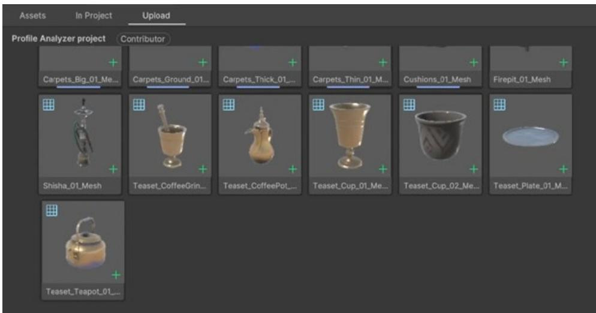

Drag assets into the Upload tab to upload to the cloud.

You can then import files into other projects directly from the Asset Manager window, making this system easy to use and a comprehensive archive of all your project assets.


Click import to download and import the files into your project.

Tags are auto generated to enable quick search when you have lots of assets. The assets are also linked to projects, so you can limit your search to assets that belong to a specific project or artist.


Auto-generated tags make searching for assets quick and easy.

Assets can be edited in the Unity Cloud. Add custom thumbnails, extra image previews, more tags, and comments.


The status of the model can be changed on the Cloud to let others know if the asset is in draft, in review, approved, rejected, published, or withdrawn. Adding a comment allows you to include further details about changes. The status of the asset will then be visible in the Asset Manager window in Unity.

Edit assets to add extra image previews and tags.

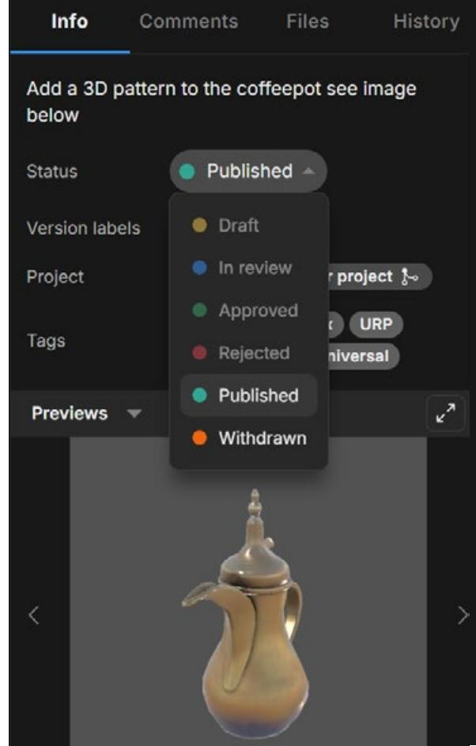

Change an asset's status.

<span id="page-30-0"></span>

Team members always have access to the latest version, reducing issues when working with asset iterations.

Asset Manager works with UVCS by enabling the integration on the Cloud.

| Integrations                       |                                                      | ×                              |
|------------------------------------|------------------------------------------------------|--------------------------------|
| Editor<br>38 Pixyz Studio          | Version Control<br>Unity Version Control System Beta |                                |
| Python SDK<br>8<br>Version Control | See your Unity VCS files in the Asset Manager.       | @ Synced Learn more Disconnect |

Integrate Asset Manager to UVCS to synchronize the data.

Any modifications made through UVCS will automatically synchronize with Unity Asset Manager, preventing redundant content creation within your team.

Learn more about the benefits of Unity Asset Manager [here.](https://unity.com/products/asset-manager)

You can also watch [this Asset Manager tutorial](https://learn.unity.com/tutorial/unity-asset-manager-guide#) on Unity Learn.

#### **Build Automation**

Build automation is an integral part of any DevOps strategy. You can run builds on the cloud as well as run builds simultaneously for all your target platforms. Instead of waiting for builds to complete sequentially on your device you can spend that time creating your project.

In the Unity Cloud dashboard you can set up as many build targets as you like from the **Configurations** section.

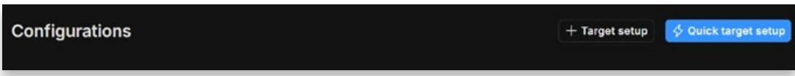

Click **Quick target setup** to create a Build target (alternatively, you can click Target setup if you want to configure more advanced options).


Choose a platform to build for. You can set up numerous build targets for each platform.


Target platforms to build for

You can build from any branch, and set up multiple targets for each branch. You can also select specific versions of Unity.

| Identity information:                                                                                                                               |   |
|-----------------------------------------------------------------------------------------------------------------------------------------------------|---|
| Target name                                                                                                                                         |   |
| Default Windows desktop 64-bit                                                                                                                      |   |
| Give this build target a name using alphanumeric characters, spaces, and the following characters: . - @ (e.g. 'Default Windows<br>desktop 64-bit') |   |
| Repo *                                                                                                                                              |   |
| Asset Manager                                                                                                                                       | V |
| Choose the repo that our systems will build from                                                                                                    |   |
| Branch *                                                                                                                                            |   |
| main<br>8                                                                                                                                           |   |
| main                                                                                                                                                |   |
| A liminostast innal inninimmanna sant                                                                                                               |   |
| Enter your project subfolder path                                                                                                                   |   |
|                                                                                                                                                     |   |
| Versioning:                                                                                                                                         |   |
| Unity version (1                                                                                                                                    |   |
| Always Use Latest 6000.x                                                                                                                            | V |
|                                                                                                                                                     |   |
| Auto detect Unity version (1                                                                                                                        |   |
| > Build with closest version (1                                                                                                                     |   |

Choose a branch to create the build from.

Note: Windows 11 in the Builder operating system, at the time of writing, offers 200 free minutes of build time per month.

You can then set up a schedule. You can either build once to test your progress or set up a repeating schedule. The example below shows a daily schedule that will produce a build at 9.45 pm so that the latest game build is available every morning to check for any issues or bugs. You will receive an email message after completion of the build to indicate its status, whether it was a success or a fail.

| Basic info<br>Required                          | Scheduling                                                                                                                                                                                                                                                                                                                                              |   |
|-------------------------------------------------|---------------------------------------------------------------------------------------------------------------------------------------------------------------------------------------------------------------------------------------------------------------------------------------------------------------------------------------------------------|---|
| Builder configuration<br>Required<br>Scheduling | Choose to set up auto-build triggers and recurring build times. You can also skip this step and edit it later.<br>Auto-build: automatically start builds when your repository is updated.<br>Auto-cancel: automatically cancel previously pending builds when any new build is triggered.<br>Configure a repeating build schedule:<br>Interval<br>Daily | V |
|                                                 | Time of day<br>09:45 PM<br>Enable a clean build (1                                                                                                                                                                                                                                                                                                      | 0 |
|                                                 | Back<br>Save configuration                                                                                                                                                                                                                                                                                                                              |   |

Create a schedule for your builds

From the configurations section you can click **Build** next to your setup to build immediately. You can also pause or delete a build configuration.

|   | Build              |
|---|--------------------|
|   | View Build History |
|   | Clone              |
| + | Add to group       |
|   | Disable            |
|   | Delete             |
|   |                    |

Disable or delete a build schedule.


In the **Build History** section on the Build Automation dashboard, you can check the results of your builds. If any of them have failed, you can troubleshoot the failure by checking the logs.

| 8<br>Overview<br>ର୍ଚ୍ଚ<br>Explore repositories                                  | Build History<br>View Build History for All Projects        | Build<br>Upload a build |                                                                                                                                                    |            |                |                            |            |
|---------------------------------------------------------------------------------|-------------------------------------------------------------|-------------------------|----------------------------------------------------------------------------------------------------------------------------------------------------|------------|----------------|----------------------------|------------|
| Version Control ▼                                                               |                                                             |                         |                                                                                                                                                    |            |                |                            |            |
| UVCS organizations<br>Or select organization<br>0<br>V<br>Repositories<br>Seats | Build health<br>2 successful<br>0 failed<br>100% successful |                         | Average build time @<br>Average build size<br>Switch to average<br>36.47 MB<br>billable build time<br>00:36:21<br>Including wait time:<br>00:36:25 |            |                | Concurrent<br>builds<br>13 | Manage     |
| User groups<br>Usage reporting<br>Settings                                      | Build Target V<br>Build Target Group V                      | Status V                | Display V                                                                                                                                          | Platform V | Q Search       |                            | Search<br> |
| Build Automation -                                                              | V                                                           | Status & #              | Build target                                                                                                                                       | Platform   | Build time (1) | Completio                  |            |
| Build history<br>Configurations                                                 | >                                                           | S<br>#1                 | 53<br>Default And                                                                                                                                  | And        | 00:41:08       | in 2 min                   | Logs       |
| Service updates<br>Settings                                                     | >                                                           | ><br>#1                 | Default Win                                                                                                                                        | 1<br>Win   | 00:31:40       | about 1 h                  | Logs<br>   |
| 0<br>Unity Cloud Drive<br>A Usage                                               |                                                             |                         |                                                                                                                                                    |            |                |                            |            |

Build history in the Cloud

You can download, share, or delete builds from the cloud.

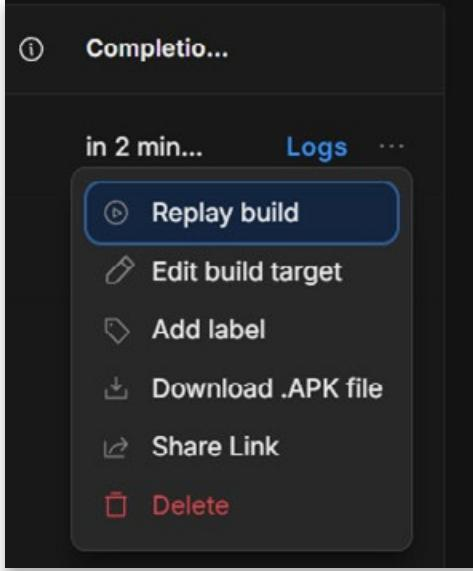

Download, share or delete builds.


Set up integrations if you would like messages to be sent to other applications such as Discord or Slack after the completion of a build.

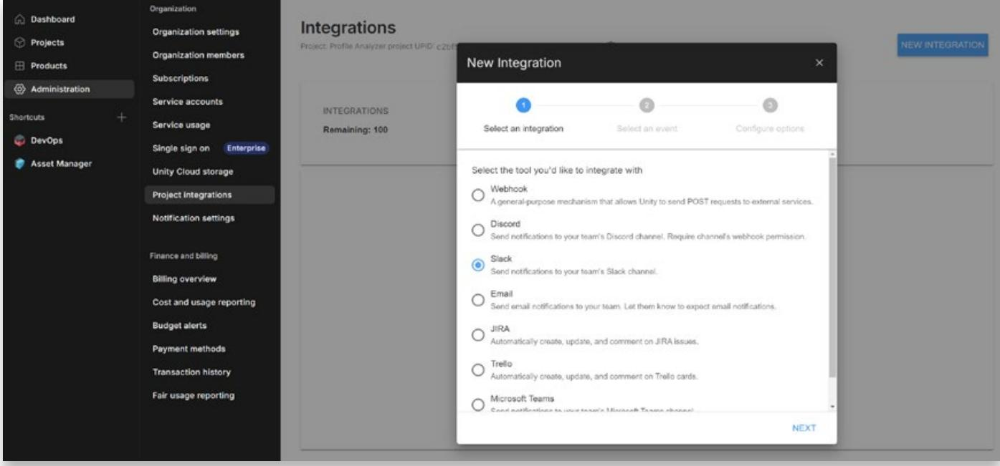

Go to **Administration** then **Project Integrations** on the Cloud and click on **New Integration**.

Add new integrations via Administration > Project Integrations.

Choose the application/s you would like to use. Now messages will be sent via those applications to inform team members.

[Learn more about Unity Build Automation](https://unity.com/solutions/ci-cd).

## <span id="page-35-0"></span>Version control systems

Now that you're familiar with some of the key terms and concepts in version control, project organization, and [naming conventions best practices](https://unity.com/resources/create-code-c-sharp-style-guide-e-book?isGated=false), it's time to introduce some of the key players. Of course, no one solution is best for everyone. There are many things to consider when choosing which VCS to use in your team. Hopefully, by the end of this book, you'll have all the information you need to make that decision.

## Git

Open source, free, and flexible, [Git](https://git-scm.com/) is one of the most popular version control systems around. However, as a distributed setup it can be daunting to non-technical users.

Developed in 2005 by Linus Torvalds to control the Linux kernel development, it's remained well-maintained and open source since. Git as a platform is a command line-only tool. But many different GUIs have been developed for it, making the system more accessible to users.

There can often be some confusion between Git and [GitHub](https://github.com/). GitHub is a hosting service for Git repositories, but you can use Git without using GitHub. That said, GitHub is a very popular service because there is a free version (with some limitations), and it doesn't require any custom server setups.

| GitHub |  |  |  |  |  |
|--------|--|--|--|--|--|

Some popular Git GUI clients include:

[Fork](https://git-fork.com/): It's a fast and friendly GUI that you can download for a free evaluation.


Fork

<span id="page-37-0"></span>

#### [GitKraken:](https://www.gitkraken.com/) This offers a more visual and accessible way of working with Git with an intuitive UI as well as the flexibility to switch between a GUI or a CLI terminal.

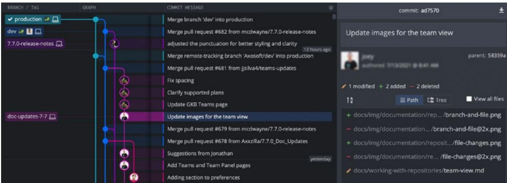

GitKraken

Microsoft [Visual Studio Code](https://code.visualstudio.com/): VS Code has source control integration built in, and with all the extensions available, you can avoid using a separate program altogether.

| 0    | SOURCE CONTROL<br>=                             | V versioncontrol.md (Working Tree) X                                                                                             |  |
|------|-------------------------------------------------|----------------------------------------------------------------------------------------------------------------------------------|--|
|      | Message (Ctrl+Enter to commit on 'versioncontro | docs > editor > ¥ versioncontrol.md > @ # Using Version Control in VS Code > [m] ##<br>35<br>35                                  |  |
| O    | 1<br>V Staged Changes                           | <br>36                                                                        |  |
|      | scm-provider-category.png docs\editor\ima  M    | <br>36-                                                                    |  |
| ಕ್ಕೆ | 2<br>Changes                                    | 37<br>37                                                                                                                         |  |
|      | Versioncontrol.md docs\editor<br>M              | >** Note: ** VS Code will leverage your machine's Git ins<br>38<br>38<br>git-scm.com/download) first before you get these featur |  |
| >    | scm-providers-list.png docs\editor\images\ve  M | 39<br>39                                                                                                                         |  |
|      |                                                 | >** ** When you commit, be aware that if your usernam<br>40<br>40                                                                |  |
| 8    |                                                 | Git will fall back to using information from your local<br>information](https://git-scm.com/docs/git-commit#_commi               |  |
|      |                                                 |                                                                                                                                  |  |

Visual Studio Code

Microsoft [Visual Studio](https://visualstudio.microsoft.com/): As with VS Code, Visual Studio also has Git controls built in and includes a [GitHub extension](https://marketplace.visualstudio.com/items?itemName=GitHub.GitHubExtensionforVisualStudio).


Visual Studio

[SourceTree](https://www.sourcetreeapp.com/): Part of the Atlassian product group SourceTree is a free Git client for Windows and Mac that can also help you visualize and manage your Git repositories easily.

| .                      |              |              |                      | sourcetree-website (Git)                                                            |                    |  |
|------------------------|--------------|--------------|----------------------|-------------------------------------------------------------------------------------|--------------------|--|
| (1)<br>+               |              | 18<br>5      | ం                    | ਦੇ ਹੋ                                                                               | >_                 |  |
| Commit<br>Pull<br>Push |              | Branch Merge | Shelve               | Show in Finder Terminal Settings                                                    |                    |  |
| WORKSPACE              | All Branches | ം            | Show Remote Branches | <><br>Ancestor Order<br>് ><br>Jump to:                                             |                    |  |
| File status            | Graph        | Commit       | Author               | Description                                                                         | Date               |  |
|                        | O            | 67858c7      | Rahul Chha           | If master If origin/master If origin/HEAD Removing ol                               | Mar 3, 2016, 11 :  |  |
| History                |              | bdb8bef      |                      | Rahul Chhab  Merged in update-google-verification (pull request #14)                | Feb 18, 2016, 1:3  |  |
| Search                 |              | dfo975d      | Tyler Tadej          | Is origin/update-google-verification Undate google verificati - Feb 11, 2016, 2 2 2 |                    |  |
|                        |              | 3bc3290      | Tyler Tadej          | Replace outdated Atlassian logo in footer with base-64 en  Feb 11, 2016, 2:1        |                    |  |
| 19<br>BRANCHES         |              | dba4719      | Tyler Tadej          | Add gitignore                                                                       | Feb 11, 2016, 1:3  |  |
|                        |              | 1167b45      | Mike Minns           | Updated Mac min-spec to 10.10                                                       | Feb 15, 2016, 11 : |  |
| BOOKMARKS              |              | 72d32a8      | Michael Min          | Merged in hero_images (pull request #13)                                            | Feb 15, 2016, 10 : |  |
|                        |              | 246c4ff      | Joel Unger           | If origin/hero_images If hero_images Used Tinypng to c  Feb 11, 2016, 3:3           |                    |  |
| 67<br>TAGS             |              | 9d9438c      | Joel Unger           | Replacing hero images with new version of SourceTree                                | Feb 9, 2016, 2:59_ |  |
|                        |              | ce75b63      | Michael Min          | Merged in bug/date-https (pull request #12)                                         | Feb 15, 2016, 10   |  |
| REMOTES                |              | 85367bb      | Patrick Tho          | If origin/bug/date-https fixed date and https errors                                | Jan 7, 2016, 12:2  |  |
|                        |              | 4f9b557      | Joel Unger           | New Favicon                                                                         | Feb 8, 2016, 3:55  |  |
| SHELVED                |              | 384e6d5      | Rahul Chhab          | If origin/search-console-access search console google ver  Feb 3, 2016, 2:09        |                    |  |
|                        |              | 6124739      | Mike Minns           | updated to move supported version to OSX 10.9+                                      | Dec 15, 2015, 2:0  |  |
| SUBREPOSITORIES        |              | 8d687bb      | Mike Minns           | remove extra , when a line is skipped due to empty server                           | Nov 23, 2015, 2:2  |  |
|                        |              | faa195e      | Mike Minns           | Skip records with empty serverjuser id as gas rejects them                          | Nov 23, 2015, 2:1  |  |
|                        |              | Ocdfe96      | Mike Minns           | corrected paths after merge                                                         | Nov 23, 2015, 2:0  |  |
|                        |              | 051ab1b      | Mike Minns           | corrected column counting                                                           | Nov 23, 2015, 1:5  |  |
|                        |              | a723bc2      | Mike Minns           | Merge branch "au2gex"                                                               | Nov 23, 2015, 1:5  |  |
|                        |              | 6619680      | Mike Minns           | deal with invalid instance ds                                                       | Nov 23, 2016, 1:6  |  |
|                        |              | 5009882      | Michael Min          | Merged in au2gex (pull request #11)                                                 | Nov 23, 2015, 1:0  |  |

SourceTree

[Sublime Merge](https://www.sublimemerge.com/): This system offers tools for speeding up code reviews with side-by-side diffs and syntax highlighting. It's a lightweight, high-performance client.


Sublime Merge

Git is generally considered strong in branching and merging capabilities, but it can't handle large binary files as effectively as other solutions on the market. Git Large File Storage (LFS) goes some way to rectifying this.

Since Git is a distributed client, the entire repository and complete history is on the developer's machine. This makes actions such as switching branches or reverting back to a point in history extremely quick. If you're working on a large project with multiple features and release branches, a Git workflow can save countless hours.

Unity has released their [C# editor and engine code to the public on GitHub](https://github.com/Unity-Technologies/UnityCsReference). This is incredibly useful when you need to know how some functions work or how to replicate a feature of the Editor inside your own project.

GitHub also has its own Git GUI, [GitHub Desktop](https://desktop.github.com/). When working in Unity, you can also use the [GitHub for Unity](https://unity.github.com/) package to bring the Git tools directly into the Unity Editor.

As mentioned, GitHub isn't the only hosting service available for your Git projects. You can also use [Bitbucket](https://bitbucket.org/product) (from Atlassian) or [GitLab](https://about.gitlab.com/), which have many more DevOps features available to them, or one of the many other hosting services available.

See this [talk from Unite Now 2020](https://www.youtube.com/watch?v=ISW2nS_v3Ic&t=753s) on how to get started with Github, GitKraken and Unity.

## <span id="page-40-0"></span>Perforce (Helix Core)

[Helix Core](https://www.perforce.com/products/helix-core) is an enterprise-level version control system generally used by large game studios. These studios use Perforce because it features centralized repos that are most often hosted on their own servers. It does not feature visual repos, so its adoption might be more challenging for non-technical developers, but in larger studios there will be DevOps and Release Engineers to help manage the code base. Plus, as an enterprise solution, it includes a global support team.

Helix Core can also be used by small teams and you can still deploy to the cloud through solutions like [Amazon AWS](https://www.perforce.com/products/helix-core/install-enhanced-studio-pack-aws) or Microsoft [Azure](https://www.perforce.com/products/helix-core/install-enhanced-studio-pack-azure).


Helix Core P4V interface

Helix Core can handle large files and there's a built-in Unity Editor integration that's covered in a later section.

To learn more about integrating your Unity workflow with Helix Core, check out this [Perforce](https://www.perforce.com/blog/vcs/how-to-use-unity-version-control)  [blog post](https://www.perforce.com/blog/vcs/how-to-use-unity-version-control).

## <span id="page-41-0"></span>Apache Subversion

Like Git, [Apache Subversion](https://subversion.apache.org/) (known as SVN) is a free and open-source version control system. Unlike Git, it's a centralized VCS that can handle large binary files. However, it's still a command line system that requires one of the many third-party GUI clients to be a bit more user friendly. One such client is [SmartSVN](https://www.smartsvn.com/download/).


SmartSVN GUI

Before Git LFS, SVN was a popular choice when working in Unity. As a centralized solution, it was simpler to work with and, as mentioned, better for working with large files. Where SVN falls behind the other tools is when you start to use branches and need to merge between them. Merging in SVN has many pains, especially when it comes to conflicts – or even false conflicts – between files. A merge operation that would take minutes in another VCS may take hours to go through manually in SVN.

For more information on setting up Unity to work with SVN, check out the [Unity documentation.](https://docs.unity3d.com/6000.0/Documentation/Manual/SmartMerge.html)

## Unity Version Control

[Unity Version Control](https://unity.com/products/plastic-scm?utm_source=demand-gen&utm_medium=PDF&utm_campaign=asset-links-gmg-achieve-quality&utm_content=version-control-and-project-organization-ebook) (UVCS) is a flexible version control system with unique interfaces to support programmers and artists alike. It excels at handling large repos and binary files, and as both a file-based and changeset-based solution, it gives you the capability to download only the specific files you're working on, rather than the entire project build.

There are three ways to access UVCS: via multiple applications and repositories through the UVCS [desktop client](https://docs.unity.com/ugs/en-us/manual/devops/manual/version-control-desktop-client), by adding it to your projects [through the Unity Hub](https://learn.unity.com/tutorial/how-to-use-the-unity-hub?courseId=6401bbfcedbc2a22aaebd59b), or accessing the repository on Unity cloud via your web browser. See the section "[Get started with UVCS in](#page-61-0)  [Unity 6](#page-61-0)" for more information on how to set it up.

Small teams of up to three users can sign up for free and at the time of writing, get up to 5GB of cloud storage, along with access to the Version Control software, including [Gluon.](https://unity.com/solutions/version-control-artists)

Gluon is a slimline client designed to let artists work like artists, not programmers. It allows you to pick only the files that you're going to work on and check them out from the server, locking them from being modified by anyone else. Once you complete your work, you check the files back in. The Gluon GUI removes the more complex concepts that work better for programmers than for other, less technical users.


Gluon offers a workflow especially designed for artists, making it easy to preview files and history as well as to check in changes.

For artists, both UVCS and Gluon include ways to diff images. The image diff tool lets you compare two versions of the same file visually, a feature that many other systems don't offer.

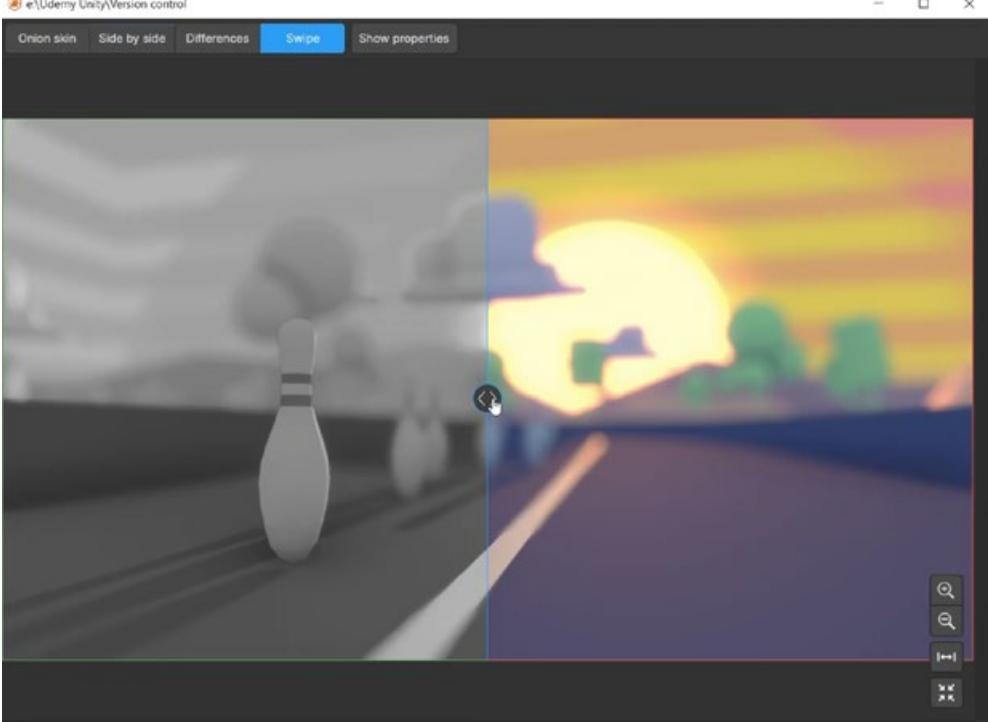

A diff viewer in Swipe mode: Go from one version to the other by dragging the swipe control, a useful feature for tracking image evolution

The standard UVCS GUI client has all the features they would be looking for and more for the programming team. The GUI has an interactive visual Branch Explorer that shows the true relationships of all the branches in a project. There is also a built-in Code Review system that you can use to request the review of your work from other groups or team members.


The branch explorer visualizes the merge structure of the project. It evolves horizontally from left to right.

One of the key strengths of UVCS is that it has the flexibility to be configured for a distributed or centralized workflow. In fully distributed mode, developers work with a repository on their local machine, checking in, branching, and merging with ease. Developers will then push and pull changes to the server to share them when ready.

In centralized mode, users check out and check in their changes directly to the server so everyone is working on the latest changes. However, as development teams have grown into global organizations, everyone communicating with one central server isn't always beneficial. UVCS can also be configured to work in a multi-site system. In this system, servers are set up at each site, so teams can check in to their local server, keeping their workflow fast and hard drives happy. Then, the distributed servers communicate with each other to a central or cloud server.


See the section [Get started with UVCS in Unity 6](#page-61-0), along with [this Unity Learn quick-start](https://learn.unity.com/tutorial/unity-version-control-guide)  [tutorial](https://learn.unity.com/tutorial/unity-version-control-guide), for the steps to setting up UVCS in Unity.

## <span id="page-44-0"></span>VCS comparison

|             |                                                                    | UVCS | Git | Perforce | Subversion |
|-------------|--------------------------------------------------------------------|------|-----|----------|------------|
| Flexibility | Work centralized<br>Checkin only, no push/<br>pull                 |      |     |          |            |
|             | Work distributed<br>Push/pull + local repo                         |      |     |          |            |
|             | Large repos                                                        |      |     |          |            |
| Binaries    | Large files                                                        |      |     |          |            |
|             | Lock files to avoid<br>merging                                     |      |     |          |            |
|             | Visualizes your repos<br>(so you don't need a<br>PhD in branching) |      |     |          |            |
| GUI         | User-friendly GUIs                                                 |      |     |          |            |
|             | Artist-friendly GUI<br>and workflow                                |      |     |          |            |
| Workflow    | Creates effective task<br>branches                                 |      |     |          |            |
|             | Detects merges<br>between branches                                 |      |     |          |            |
|             | Provides diff and<br>three-way merge<br>tools                      |      |     |          |            |
| Merge       | Tools help you<br>understand the merge                             |      |     |          |            |
|             | Good merging<br>renames, moved files,<br>directories, refactors    |      |     |          |            |

<span id="page-45-0"></span>

### Setting up Unity to work with version control

This section will help you set up Unity to work with Git, Perforce, or UVCS, depending on your preference. By understanding some of the key workflows for each solution, you can make an informed decision about which system will best suit your team.

#### **Editor project settings**

#### Perforce Helix Core

Unity Editor integration is available with most version control systems, and Perforce Helix Core integration is built into the Editor. You only need to enable it via **Edit** > **Project Settings** > **Version Control**. Set the Mode to Perforce, and fill in the information of your workspace and server settings.

| Project Settings                                    |                                   |                                |                 |                   |           |  |
|-----------------------------------------------------|-----------------------------------|--------------------------------|-----------------|-------------------|-----------|--|
|                                                     |                                   | ರ                              |                 |                   |           |  |
| Adaptive Performance<br>Audio<br>Burst AOT Settings | Version Control                   |                                | -1<br>0<br>14   |                   |           |  |
| Editor                                              | Mode                              | Perforce<br>œ                  |                 |                   |           |  |
| Graphics                                            | Username                          | Ben                            |                 |                   |           |  |
| Input Manager                                       | Password                          |                                |                 |                   |           |  |
| Input System Package<br>Settings                    | Workspace                         |                                | Ben_CurveEditor |                   |           |  |
| Memory Settings                                     | Server                            |                                | Iccalhost:1666  | 4                 |           |  |
| Package Manager                                     | Log Level                         |                                | Notice          |                   |           |  |
| Physics<br>Settings                                 | Cornecting                        |                                |                 |                   |           |  |
| Physics 2D<br>Player                                |                                   |                                |                 |                   | Reconnect |  |
| Preset Manager                                      | Work Offine                       |                                |                 |                   |           |  |
| Quality                                             | Automatic Add                     | >                              |                 |                   |           |  |
| Scene Template<br>Script Execution Order            | Asyne Status                      |                                | >               |                   |           |  |
| Services                                            | Show Falled Checkouts             | 1                              |                 |                   |           |  |
| Unity Cloud                                         | Overwrite Failed Checkout Assets. |                                | >               |                   |           |  |
| ShaderGraph                                         | Smart merge                       |                                | Ask             |                   |           |  |
| Tags and Layers<br>TextMesh Pro<br>Time             | Version Packages Outside Project  |                                |                 |                   |           |  |
| Timeline                                            | Overlay loons                     |                                |                 |                   |           |  |
| Ui Toolkit                                          | Project Window                    |                                | V               |                   |           |  |
| Version Control                                     | Hierarchy Window                  |                                | >               |                   |           |  |
| Unity Version Control Settings                      | Other Windows                     |                                | >               |                   |           |  |
| Visual Scripting<br>XR Plugin Management            | · Local                           | · Deleted Local                |                 | 2 Conflicted      |           |  |
|                                                     | Out of Sync                       | × Deleted Remote               |                 | Locked Local      |           |  |
|                                                     | Checked Out Local                 | + Added Local<br>Locked Remote |                 |                   |           |  |
|                                                     | Checked Out Remote                | + Added Ramote                 |                 | O Updating Status |           |  |
|                                                     |                                   |                                |                 |                   |           |  |
|                                                     |                                   |                                |                 |                   |           |  |
|                                                     |                                   |                                |                 |                   |           |  |

Setting up Perforce Helix Control for a project


Once this is enabled, you will see that files are now considered "Under Version Control," with the option to check them out.

Once a file is checked out, you can lock, unlock, submit, or revert the file. Choosing to submit will bring up a changeset dialog for you to add your commit message before submitting it into the repository.

| Description                              |  |                    |
|------------------------------------------|--|--------------------|
| Added player to the scene start position |  |                    |
|                                          |  |                    |
| Assets\Scenes\OasisScene.unity +meta     |  |                    |
|                                          |  |                    |
|                                          |  | Cancel Save Submit |

Changeset dialog box

#### Use the Helix P4V interface to view the project history.

| Jocalhost:1666, Ben - Perforce Helix P4V             |                            |                                                  |      |                   |                           |                                     |       |       |           | 1 2017 |       | X |
|------------------------------------------------------|----------------------------|--------------------------------------------------|------|-------------------|---------------------------|-------------------------------------|-------|-------|-----------|--------|-------|---|
| Fie<br>Edit<br>Search View Actions Connection Tools  | Window<br>Help             |                                                  |      |                   |                           |                                     |       |       |           |        |       |   |
| 0<br>1<br>Refresh<br>Gettatest<br>Chediout<br>Gubmit | 1<br>Add Delete Revert     |                                                  | Diff | (ને.<br>Traelspse | 14<br>and new<br>Revoraph | Int                                 | Clone | Fetch | Push      |        | Cance |   |
| //CurveEditor/                                       |                            |                                                  |      |                   |                           |                                     |       |       |           |        | ▶     |   |
| Depot Depot De Workspace<br>II.<br>1                 |                            | + = Pencing @ Submitted D                        |      |                   |                           |                                     |       |       |           |        |       |   |
| (no workspace selected)<br>P                         | Filter: User is "Ben"<br>> |                                                  |      |                   |                           |                                     |       |       | 3 matches | 21     |       |   |
| Curve Editor                                         | Change                     | ▼ Date Submitted                                 |      | Submitted By      | Description               |                                     |       |       |           |        |       |   |
| Assets<br>ProjectSettings                            | ▼ 43                       | 11/11/2021 21:40 Ben                             |      |                   |                           | Added the Sample Scene              |       |       |           |        |       |   |
|                                                      |                            | //CurveEditor/Assets/Scenes/SampleScene.unity #2 |      |                   |                           |                                     |       |       |           |        |       |   |
|                                                      | C<br>4<br>2                | 09/11/2021 23:08 Ben                             |      |                   |                           | Changed the Panel background color. |       |       |           |        |       |   |
|                                                      | 4<br>4<br>1                | 09/11/2021 23:03 Ben                             |      |                   |                           | Added CurveEditor base project      |       |       |           |        |       |   |
| //CurveEditor/ProjectSettings                        |                            |                                                  |      |                   |                           |                                     |       |       |           |        |       |   |

View the project history.

For more on getting started with Perforce Helix Core and Unity, check out the [Perforce blog](https://www.perforce.com/blog/vcs/how-to-use-unity-version-control)[.](https://www.perforce.com/blog/vcs/how-to-use-unity-version-control)

### <span id="page-47-0"></span>UVCS

UVCS is integrated with the Unity Editor, making it easy to get started and simplify workflows. When you create a new Unity project in the Hub, you can immediately integrate Unity VCS by selecting the **Use Unity Version Control** checkbox.

To connect UVCS to an existing project in the Editor, open **Window > Unity Version Control.**  The tab will appear in the Project window.

| @ Project Settings                                  |                                                                                                                                                                                                   | na     | × |
|-----------------------------------------------------|---------------------------------------------------------------------------------------------------------------------------------------------------------------------------------------------------|--------|---|
| Project Settings                                    |                                                                                                                                                                                                   |        |   |
|                                                     | a                                                                                                                                                                                                 |        |   |
| Adaptive Performance<br>Audio                       | Unity Version Control Settings                                                                                                                                                                    |        |   |
| Burst AOT Settings<br>Editor<br>Graphics            | Unity VCS is enabled<br>Disable                                                                                                                                                                   |        |   |
| In-Editor Tutorials                                 | General                                                                                                                                                                                           |        |   |
| Input Manager                                       | Show checkouts                                                                                                                                                                                    | V      |   |
| Input System Package<br>Settings                    | Auto-refresh                                                                                                                                                                                      | 1      |   |
| Memory Settings                                     | File Change Settings                                                                                                                                                                              |        |   |
| ML-Agents                                           | Find changed files in the workspace                                                                                                                                                               | V      |   |
| Package Manager<br>Physics                          | Check the content to determine files as changed, not just timestamp                                                                                                                               |        |   |
| Settings                                            | File Visibility Settings                                                                                                                                                                          |        |   |
| Physics 2D                                          | Group changes in "change lists"                                                                                                                                                                   |        |   |
| Player                                              | Show private files                                                                                                                                                                                |        |   |
| Preset Manager<br>Quality                           | Show ignored files                                                                                                                                                                                |        |   |
| Scene Template                                      | Show hidden files                                                                                                                                                                                 |        |   |
| Script Execution Order<br>Services                  | Show deleted files and directories                                                                                                                                                                | SOURCE |   |
| ShaderGraph                                         | File Move and Rename Detection                                                                                                                                                                    |        |   |
| Tags and Layers                                     | Find moved and renamed files and directories                                                                                                                                                      | 1      |   |
| TextMesh Pro<br>Settings                            | Match binary files only when they have the same extension                                                                                                                                         | 1      |   |
| Time                                                | Match text files only when they have the same extension                                                                                                                                           |        |   |
| Timeline                                            | Similarity percentage                                                                                                                                                                             | 90     |   |
| UI Toolkit                                          |                                                                                                                                                                                                   |        |   |
| V Version Control<br>Unity Version Control Settings | File system watcher is enabled                                                                                                                                                                    |        |   |
| Visual Scripting<br>XR Plugin Management            | Unity Version Control watches the workspace for changes to make the<br>operation faster. This removes the need to walk the directory structure,<br>although move matching can still consume time. |        |   |
|                                                     |                                                                                                                                                                                                   |        |   |

UVCS in the Project Settings

UVCS will feel familiar to Unity users, and simplifies workflows by eliminating the need for an additional client. Files can be added, checked out, reverted, checked in, or submitted, directly from the Editor.


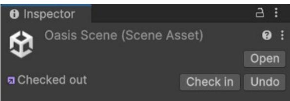

Working with files in UVCS from the Unity Editor

| Check in Changes                     |                    |
|--------------------------------------|--------------------|
| Add a comment to your check-in       |                    |
| Created an initial scene layout      |                    |
| Files                                |                    |
| Assets\Scenes\OasisScene.unity +meta |                    |
|                                      |                    |
|                                      | Check in<br>Cancel |

Checking in a file

UVCS also has the advantage of having a Changesets tab available in the Unity Editor via **Window** > **Unity Version Control**.

| Console<br>Project                 | O Unity Version Control                                                   |                                                     |                  |
|------------------------------------|---------------------------------------------------------------------------|-----------------------------------------------------|------------------|
| Pending Changes                    | Incoming Changes<br>Changesets                                            | Branches<br>×                                       | & Search         |
|                                    |                                                                           |                                                     |                  |
| V Item (1/1 selected)              | Status                                                                    | Date modified                                       |                  |
| > Changed items (1/1 selected)     |                                                                           |                                                     |                  |
| > Assets\Scripts\Rotator.cs        | Changed                                                                   | 1 minute ago (13/06/2024 13:34:32)                  |                  |
|                                    |                                                                           |                                                     |                  |
|                                    | Changed rotator script so it rotates when you press the left mouse button |                                                     |                  |
|                                    |                                                                           |                                                     | Check in Changes |
|                                    |                                                                           |                                                     |                  |
| @ Unity Version Control<br>Console |                                                                           |                                                     |                  |
| Incoming Changes<br>anges          | Branches<br>Changesets<br>×                                               |                                                     |                  |
|                                    |                                                                           |                                                     |                  |
| Creation date                      | Created by                                                                | Comment                                             |                  |
| 13/06/2024 12:19:23                | @ steve@email.com                                                         | Created a rotator script for the airplane propellor |                  |
| 11/06/2024 13:35:19                | 0<br>pete@email.com                                                       | Created a scene with spline extrusion               |                  |
| 11/06/2024 13:07:19                | 0<br>pete@email.com                                                       | Added WW2 Thunderbolt asset to a new scene          |                  |
| 10/06/2024 20:40:52                | 0<br>steve@email.com                                                      | Added a new spline                                  |                  |
| 10/06/2024 20:35:17                | 0<br>steve@email.com                                                      | Added a red capsule                                 |                  |
| 10/06/2024 20:34:02                | 0<br>steve@email.com                                                      | Setup second workspace                              |                  |
| 06/06/2024 19:33:23                | 2 pete@email.com                                                          | Root dir                                            |                  |

Pending changes and Changesets tabs

<span id="page-49-0"></span>

For more information on setting up Version Control in Unity, check out the [documentation](https://docs.unity3d.com/6000.0/Documentation/Manual/Versioncontrolintegration.html).

#### Git and other solutions

For all other VCS, open the **Edit** > **Project Settings** > **Version Control** window, and select Visible Meta Files from the dropdown menu. There are no other options here, but meta files must be visible in order for version control systems to detect them (see previous chapter on Meta Files).

#### **What to ignore**

When working with a Unity project, or any project for that matter, only files that cannot be generated should be placed under version control.

For Unity projects, that means only files in the Assets and Project Settings folders should be committed to your repository. Unity can automatically recreate all the other folders. Under no circumstance should you commit the Library folder, since this folder can get very large and Unity will recreate it when launching the Editor if it doesn't exist.

- UVCS automatically selects the appropriate folders and files to place under version control when set up from the Unity Editor. There is a list that is saved in the `ignore. conf` file at the root of the project that describes which files are ignored. To learn more about setting up the "ignore.conf" file, check out this [blog post](https://blog.plasticscm.com/2020/01/definitive-ignoreconf-for-unity-projects.html).
- With Perforce, you need to explicitly add the Assets and Project Settings folders to your depot.
- Git requires a **.gitignore** file to indicate what files should never be included. Depending on your Git GUI client, you can select a template when creating a repository, or this can be done through GitHub if you set the hosting up first. Alternatively, a template can be downloaded [here.](https://github.com/github/gitignore/blob/master/Unity.gitignore)

You should also avoid committing things like .exe or .apk files. Additionally, gradle and xcode projects built from your Unity project should not be added to the repository.

A small exception to this rule is if you were to set up automated build processes for your Gradle or Xcode projects, but then they would be typically committed to a repository of their own.

<span id="page-50-0"></span>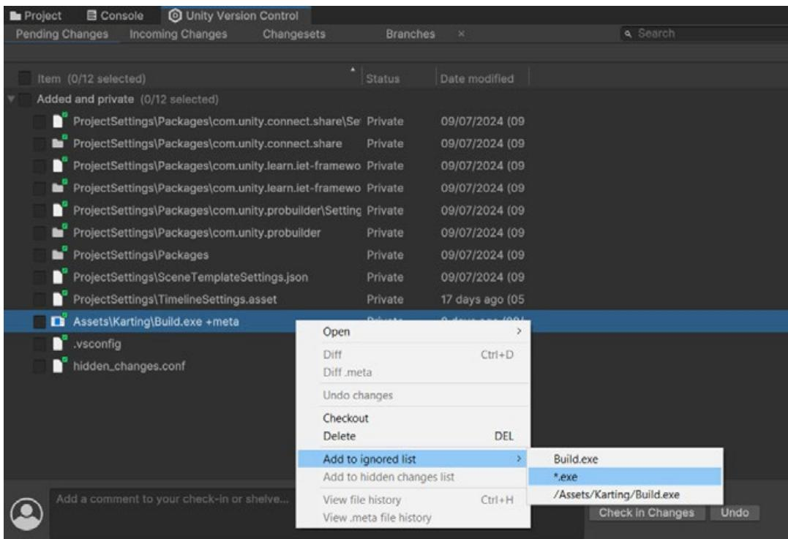

Files can be added to the ignored list directly from the Unity Editor when using UVCS.

#### **Working with large files**

Unity projects are made up of a lot more than just code. In fact, scripts can often be heavily outnumbered by other asset files in a Unity project. These assets are stored as binary files: Textures, models, Prefabs, audio clips, timelines, and so on. This results in two things:

- They can be hard to compare between revisions.
- The diff cannot be described, so the whole file is written when a change is pushed to the repo.

Again, in a distributed environment, the entire project history is available on a user's local machine. Now if you have a history of large files that have had many changes over a long time, then you will have that many copies of the file stored on your machine. This can quickly consume a large portion of your hard drive space!

This is one of main reasons that historically, teams preferred a centralized workflow. This way, large historical versions of binary files would only live on a central server, with individual users only accessing the latest version on their machines.

Both Perforce and UVCS are centralized systems that can handle large files well. UVCS also gives you the option to work in a distributed pipeline, and large file sizes is the tradeoff that you need to consider when choosing between these options.


Another feature of UVCS is the [Dynamic Workspace,](https://blog.plasticscm.com/2021/07/dynamic-workspaces-alpha-for-windows.html) which relies on a virtual filesystem. This means that the Dynamic Workspace downloads files on demand – so, while you see everything in your workspace, in reality not everything is downloaded.

Git, being distributed, can struggle with large files. Be sure to also include [Git LFS](https://git-lfs.github.com/) if you will be working with large files. Git LFS replaces your large files in the .git folder with text pointers while storing the actual asset on a server such as GitHub.

## <span id="page-52-0"></span>Best practices for version control

Regardless of which VCS you use, many best practices can help your team work more effectively. Every team has different needs, so every practice won't fit every team.

These tips come from the Unity [Enterprise Support Team](https://unity.com/solutions/accelerate-solutions-games), who are helping to optimize realworld projects for some of the biggest studios out there.

## Commit little, commit often

This is by far the easiest change you can make to your workflow, yet it's the one that some developers struggle with the most. When working with other project management tools, it's likely you have already broken down the work into small, manageable tasks. Commits should be exactly the same.

A single commit should only relate to one task or ticket, unless a single line of code magically fixes several bugs. If you are working on a larger feature, break it down into smaller tasks, and make commits for those tasks. We'll dive into feature branches later.

The biggest advantage of using smaller commits is that when something does go wrong, you will find the change much more easily and can revert the negative change without affecting any other positive changes.

<span id="page-53-0"></span>

## Keep commit messages clean

Commit messages describe the history of your project. It's much easier to find the change that added high-score tables to your game if its commit message says "Added high score tables to the menu" and not "Menu updated!"

When working with a task ticketing system like JIRA or GitLab, it's even better to include a ticket number in your commit. Many systems can be set up to work together with smart commits, in which you can actually reference tickets and change their status from your commit message.

For example, the commit "JRA-123 #close #comment task completed" would set JIRA ticket JRA-123 to closed, leaving the comment "task completed" on the ticket.

For more on setting this workflow up, see the [documentation in JIRA](https://support.atlassian.com/jira-software-cloud/docs/process-issues-with-smart-commits/) or the [Pivotal Tracker](https://docs.gitlab.com/ee/user/project/integrations/pivotal_tracker.html#pivotal-tracker-service)  [service in GitLab.](https://docs.gitlab.com/ee/user/project/integrations/pivotal_tracker.html#pivotal-tracker-service)

## Avoid indiscriminate commits

The only time "commit -a" (the git command for "commit all changes") or any of its counterparts should be used is with the first commit of a project. Usually, this is when the only files in the project are README.md.

A commit should only ever include files that are related to the change you are committing to the repo. Particular care should be taken when working with Unity projects, and some changes may result in several files being marked as changed, such as scenes, prefabs, or sprite atlases, even though you didn't intend to make any changes to them.

If you accidentally commit a change to a scene that someone else is working on, that could cause a headache for them when they go to commit their changes and find they need to merge your changes first.

This is one of the most common mistakes that people who are new to version control will make. It's important to understand that you should only commit what *you* have changed in the project. To learn more, check out this [blog post](https://blog.plasticscm.com/2018/10/checkin-with-reviewers-in-mind-how-to-fix-pull-requests.html) on how to speed up your workflow.

## <span id="page-54-0"></span>Get the latest

As often as it makes sense, pull the latest changes from the repo into your working copy. It's not good to work off in isolation, as this only increases the likelihood of merge conflicts. A typical daily workflow in each system would be something like this.

| Git |                                 |                                                       |   | Perforce                   |  |
|-----|---------------------------------|-------------------------------------------------------|---|----------------------------|--|
| —   | git pull                        |                                                       |   | Get latest                 |  |
| —   | Then as many times as you like: |                                                       | — | Check out files to work on |  |
|     | —                               | Make edits in your working copy.                      | — | Make edits                 |  |
|     | —                               | git commit your changes.                              |   | Submit changes             |  |
|     | —                               | git pull the latest changes.                          |   |                            |  |
| —   |                                 | Once you are happy with your changeset<br>of commits: |   |                            |  |
|     | —                               | git pull once more.                                   |   |                            |  |
|     | —                               | git push to send your commits to<br>the repo.         |   |                            |  |

|   |                                        |       |                                                 |                  |                |                 | M4             |
|---|----------------------------------------|-------|-------------------------------------------------|------------------|----------------|-----------------|----------------|
|   | Choose files to submit (10):<br>v name | File  |                                                 | A In Folder      | Resolve Status | Type            | Pending Action |
|   |                                        | દ્વાર | Demo.cs meta                                    | //CurveEditor/As |                | META File       | edit           |
|   |                                        | + D   | DemoCurveEditorSettings.light  //CurveEditor/As |                  |                | LIGHTING File   | 830            |
|   |                                        | . D   | DemoCurveEditorSettings.light  //CurveEditor/As |                  |                | META File       | કર્તવ          |
|   |                                        | 10    | Editor Settings. asset                          | //CurveEditor/Pr |                | ASSET File      | edit           |
|   |                                        | + D   | manifest.json                                   | //CurveEditor/Pa |                | JSON File       | add            |
| V |                                        | ్లా   | NewBehaviourScript.cs                           | //CurveEditor/As |                | C # Source File | delete         |
| V |                                        | ్లా   | NewBehaviourScript.cs.meta                      | //CurveEditor/As |                | META File       | delete         |
|   |                                        | + B   | packages-lock. Json                             | //CurveEditor/Pa |                | JSON File       | add            |
|   |                                        | 202   | ProjectSettings.asset                           | //CurveEditor/Pr |                | ASSET File      | edit           |
|   |                                        | 30    | VersionControlSettings.asset                    | //CurveEditor/Pr |                | ASSET File      | edit           |
|   |                                        |       |                                                 |                  |                |                 |                |

Saving changes to a new changelist in P4V

| d: VGIT \CurveEditor \Assets' \ view Text Document.exe                                                                                    |                                                                                                                                                                           |   |  |  |  |  |  |  |
|-------------------------------------------------------------------------------------------------------------------------------------------|---------------------------------------------------------------------------------------------------------------------------------------------------------------------------|---|--|--|--|--|--|--|
| Depot De Workspace<br>11. 7.                                                                                                              | + D Fies & Pending a O Submitted Worlspaces   Dranshes                                                                                                                    |   |  |  |  |  |  |  |
| Ben_CurvelEditor                                                                                                                          | Filter: User is "Ben"                                                                                                                                                     |   |  |  |  |  |  |  |
| · d: gIT CurveEditor                                                                                                                      |                                                                                                                                                                           |   |  |  |  |  |  |  |
| ><br>1<br>Assets                                                                                                                          | Description<br>Change<br>· User<br>> A default Ben<br><enter description here>                                                                                            |   |  |  |  |  |  |  |
| RuntimeCurveEditor<br>1                                                                                                                   | * A 9<br>Removed the NewBehaviour<br>Ben                                                                                                                                  |   |  |  |  |  |  |  |
| 13<br>Scenes<br>0<br>AnotherScript.cs #2/2 <bext><br>12<br>AnotherScript.cs.meta #2/2 <text><br>12<br>RuntimeCurveEditor meta #1/1 <hext> | [/CurveEditor [Assets, New BehaviourScript, cs #1/1 <text><br>[/CurveEditor  Assets NewBehaviourSolpt.calimeta #1/1 <text><br>2<br>Shelved Items (0)                      |   |  |  |  |  |  |  |
| C<br>Scenes.meta #1/1 <text><br>Ubrary                                                                                                    | 0<br>Submit Changelist: 9 (Ben_CurveEditor, localhost:1666, Ben)<br>1                                                                                                     | × |  |  |  |  |  |  |
| Logs                                                                                                                                      | Write a changelist description                                                                                                                                            |   |  |  |  |  |  |  |
| ાંગ                                                                                                                                       | Removed the NewBehaviour                                                                                                                                                  |   |  |  |  |  |  |  |
| Temp<br>UserSettings<br>C<br>.vsconfig<br>B<br>Assembly-CSharp.csproj<br>C<br>Curvellditor.sin                                            | [M4]<br>· Choose files to submit (Z):                                                                                                                                     |   |  |  |  |  |  |  |
|                                                                                                                                           | V name<br>File<br>. In Folder<br>Resolve Status<br>Type<br>Pending Action                                                                                                 |   |  |  |  |  |  |  |
|                                                                                                                                           | V<br>র্ণাট্য<br>C = Source File<br>NewBehaviourScript.cs<br>/Curveliditor/As<br>delete<br>><br>P<br>NewBehaviourScript.cs.meta<br>//CurveEditor/As<br>META File<br>delete |   |  |  |  |  |  |  |
|                                                                                                                                           |                                                                                                                                                                           |   |  |  |  |  |  |  |

Submitting a changeset in P4V

UVCS workflows are a little different because you can work in centralized, distributed, or multi-site configurations.

| UVCS (centralized) |                               | UVCS (distributed) |                                            | UVCS (multi-site) |                            |  |
|--------------------|-------------------------------|--------------------|--------------------------------------------|-------------------|----------------------------|--|
| —                  | Sync repositories             | —                  | Pull changes from the                      | —                 | A hybrid of the two,       |  |
| —                  | Pull visible                  |                    | server                                     |                   | depending on your<br>setup |  |
| —                  | Check out files to work<br>on | —                  | Check in changes to<br>your local copy     |                   |                            |  |
| —                  | Make edits                    | —                  | Pull any new changes                       |                   |                            |  |
| —                  | Check in changes              | —                  | Push your changes<br>back up to the server |                   |                            |  |
| —                  | Sync repositories             |                    |                                            |                   |                            |  |
| —                  | Push visible                  |                    |                                            |                   |                            |  |

Multi-site configurations can be tailored to custom needs, with each user working in either a centralized or distributed workflow.

<span id="page-56-0"></span>

Consider the following example of two teams:

- Each team has an on-site server.
- Team members at both sites check in locally or distributed but benefit from the speed of a close on site server.
- Servers push/pull between one another to keep fully or partially in sync.


Multi-site UVCS configuration

### Know your toolset

Whichever VCS your team chooses to work with, make sure that the team is comfortable using it and understands the tools at their disposal including visual clients.

If you're working with Git, not everyone needs to use the same GUI client. But make sure that everyone is comfortable with the commit > pull > push workflow, and that they know how to commit only the files they need.

If you're working with UVCS, let your artists get comfortable using [Gluon](https://unity.com/solutions/version-control-artists) to simplify their workflow. Gluon lets you decide which files you want to work on and only download those, removing the need to download and manage the entire project. It allows you to lock a file to prevent others from working on it, and, once you're finished, users can submit files back to the repository and unlock them again.

<span id="page-57-0"></span>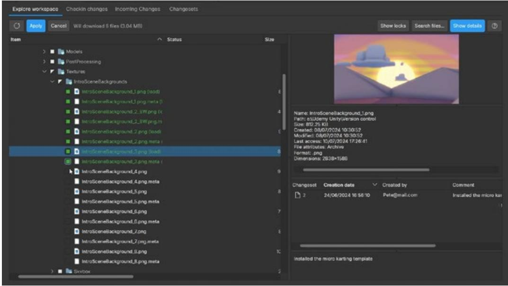

Gluon in UVCS

If you are working with Perforce Helix Core, use the built-in Unity Editor tools for managing version control directly from the Editor. This is incredibly useful, both for artists or for general handling of Unity asset files such as scenes, Prefabs, and so on. You can check out assets for modification in the Editor, make your changes, and then check them back in without even leaving Unity.

## Feature branches and Git Flow

When you're working on a long-standing project with multiple release cycles, feature branching is hugely beneficial to your workflow. Often, teams work out of the same branch of a repo that would likely be called trunk, master, or main. When you do this, your entire project moves along the same timeline.


Development along the main branch in UVCS

However, it can be beneficial to split the work off into several branches to work more effectively as a team.

In Git, a specific workflow called Git Flow focuses on using different branches for features, bug fixes, and releases. A developer starts out work on a new feature inside an isolated branch, and when they're finished, it's merged back into the main branch. Meanwhile, someone else may have had to do a hotfix on the previous release, fixed a bug, and released a new version safely, without any of the features still under development being included.


A Git Flow workflow allows for easier release management.

UVCS also features [task branches](https://docs.plasticscm.com/book/#_one_task_one_branch). For this pattern, you create a new branch for every task that you track. While in Git Flow, we use feature branches to develop complete, sometimes large, features, task branches in UVCS are meant to be short-lived. If a task takes more than a handful of commits to implement, odds are it could be broken down into smaller tasks.

<span id="page-59-0"></span>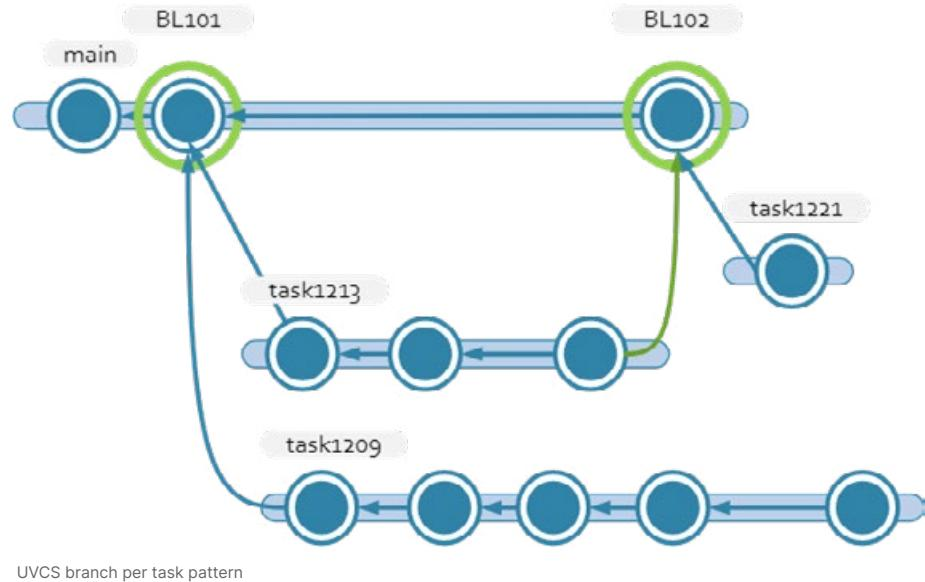

Perforce Helix Core uses a system called Streams to facilitate this style of workflow. When creating a depot to work in, you need to set it up as a stream depot type. Then, you can use the Stream Graph view to create new streams. Every stream other than the mainline stream will need to have a parent stream, so changes can be copied back up-stream.

## Pull requests

Once you've completed work on a feature branch, it's a good practice to use pull requests to get your changes back into the main stream of the repo. Pull requests are created by the developers of the feature or task, and it's usually the responsibility of a senior developer or DevOps to review the changes before accepting them into the mainline.

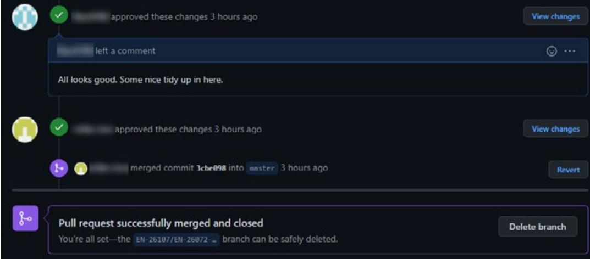

A closed pull request on GitHub


UVCS and Perforce both have automated tools to help manage merging branches back into the mainline. UVCS does this with the help of [Mergebot](https://unity.com/solutions/version-control-programmers), which automatically merges branches of a repo once they've been reviewed and passed validation. Perforce has an additional platform, [Helix Swarm](https://www.perforce.com/products/helix-swarm), for managing code reviews that can also be set up with automated testing.


UVCS code reviews are included in the GUI.

## <span id="page-61-0"></span>Get started with UVCS in Unity 6

The [Unity DevOps offering](https://unity.com/products/unity-devops) comprises UVCS and Build Automation. UVCS is free for up to three (3) team members (seats) and up to 5GB of data per month. After that, pricing depends on your monthly active users and total cloud storage. UVCS sends warning emails to the UVCS organization owner when you reach 50%, 75%, and 90% of your usage allowance for any of the UVCS services so it's easy for you to keep track of your usage.

See the [Unity Cloud pricing plans page](https://unity.com/products/compare-plans/unity-cloud) for more information or, sign into the Unity Cloud dashboard and go to the [DevOps dashboard "About" page](https://cloud.unity.com/home/organizations/default/devops/about).

There are three ways to access UVCS: via multiple applications and repositories through the UVCS [desktop client](https://docs.unity.com/ugs/en-us/manual/devops/manual/version-control-desktop-client), by adding it to your projects [through the Unity Hub](https://learn.unity.com/tutorial/how-to-use-the-unity-hub?courseId=6401bbfcedbc2a22aaebd59b), or accessing the repository on Unity cloud via your web browser.

<span id="page-62-0"></span>

## Use UVCS in a Unity project

Unity will automatically set up a repository (repo) when you create a project using the Unity Hub and check the **Version Control** checkbox.

| Use Unity Version Control                     |  |
|-----------------------------------------------|--|
| Unity Version Control Organization<br>pete GD |  |
| Repository<br>ACE FLYING                      |  |
| Server location<br>Europe West - Netherlands  |  |

Setting up Version Control in Unity Hub

This means that your project's data and files will be stored both locally on your machine, but also on the cloud, in order to help with collaboration and act as a safety backup. The name of your project becomes the name of the repo, and you can choose the server that is closest to you for high speed connections.

The Assets, Packages, and Project Settings folders are backed up onto the server on first use. You can access these files by logging into the Unity Cloud and in the repository select **File Explorer**. This shows you all the files that exist on the cloud repo.

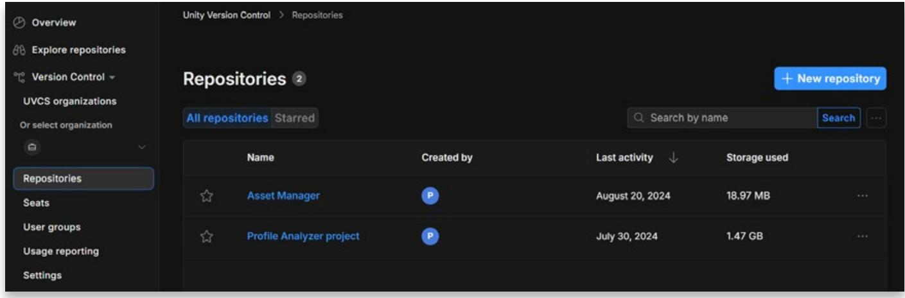

The File Explorer on the Unity Cloud dashboard shows the structure of files and folders in the repo.

UVCS ignores the Library, Logs and User Settings folders, as these are auto-generated on your computer and take up a lot of space.

Other folders that are ignored by UVCS will have a green box with a forward slash icon below the folder or file in the Project window.

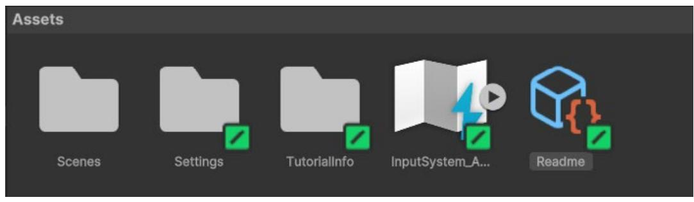

Ignored files that are not backed up on the cloud are shown with a green box containing a forward slash.

Be sure to include the Settings folder in the **Pending Changes** section of the Version Control window if the project uses URP or HDRP. If the Settings folder has a forward slash in a green box, select it and right-click. Choose **Version Control> Add to source control**.

The forward slash will become a plus icon in a green circle and these files will now be added to the pending changes list, ready to be uploaded to the cloud.

|                        | Select Dependencies                               |                     |                                                                   |                        |
|------------------------|---------------------------------------------------|---------------------|-------------------------------------------------------------------|------------------------|
|                        | Refresh<br>Reimport                               | Ctrl+R              |                                                                   |                        |
|                        | Reimport All                                      |                     |                                                                   |                        |
|                        | Extract From Prefab                               |                     |                                                                   |                        |
|                        | Unity Version Control                             | >                   | Show pending changes view                                         |                        |
|                        | Update UXML Schema                                |                     | Add to source control                                             | B                      |
| Assets > Settings      | Open C# Project<br>View in Import Activity Window |                     | Checkout<br>Check in                                              |                        |
| URP-Balan<br>URP-Balan | Properties_<br>URP-HighFi URP-HighFi              | Alt+P<br>URP-Perfor | Undo changes<br>Add to ignored list<br>Add to hidden changes list |                        |
|                        |                                                   |                     | Diff with previous revision<br>View file history                  | Shift+Ctrl+D<br>Ctrl+H |

Including settings files to the pending changes view

<span id="page-64-0"></span>

## Inviting other team members

In the Version Control window there is a button on the right of the window that you can use to invite team members.

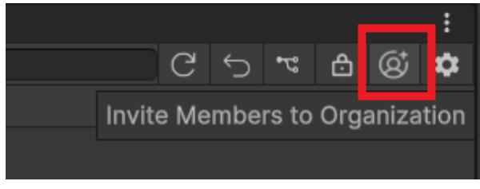

The **Invite Members to Organization** option in the Version Control window

This will take you to the Unity Cloud login page. Use your Unity ID and password to login.

DevOps will open from the shortcuts on the left and the seats section will then also open, allowing you to add extra seats to your current project. At the time of writing you can't add more than three seats in the free tier. You can upgrade to Cloud Pro to buy additional seats. See the [Unity Cloud pricing plans page](https://unity.com/products/compare-plans/unity-cloud) for more information or, sign into the Unity Cloud dashboard and go to the [DevOps dashboard "About" page](https://cloud.unity.com/home/organizations/default/devops/about).


Add extra seats from the DevOps section on the Unity Cloud.

Assign the new members a seat in your project. They should also be invited to become organization members. This gives them full access to all data on the dashboard for the cloud including usage statistics.

Go to **Administration>Organization members** and click the **invite organization members** button to add extra people to your organization.


Add extra organization members from the **Administration** option.

Assign each member an appropriate role. Choose from guest, user, or admin. Users and admin members can see all projects and you can assign roles in the project members section to give them the appropriate level of access to the project data.

This allows them to access the project and contribute to it based on their role. Users with admin status will have full access to the options available on the cloud.

An email is sent to the other members that you invite.

The invited member should then open Unity Hub and click on the drop down next to the **Add** button and choose **Add UVCS repository**:

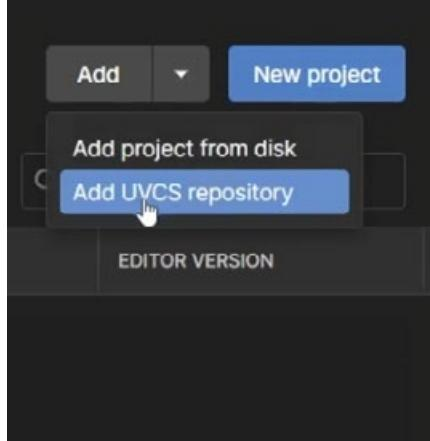

Click **Add UVCS repository** to open a project on the Unity Cloud.

**Note**: It's important that all team members are using the same version of Unity, otherwise it can cause issues when converting the project between versions.

This will then download the project from the cloud repository onto the user's computer.

## <span id="page-66-0"></span>Check in changes

As you make changes to your project you will see a green **+** icon on the files that are changed. This shows you which files to check into the server for update.

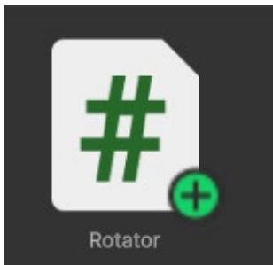

A green circle with a plus icon indicates a file has been changed and needs to be checked in.

Update your project often to make rolling back easier. Updated files are shown in the **Pending Changes** section of the Version Control window. Add a short, concise description of the changes you have made and click the **Check in Changes** button.


The Pending Changes section allows you to check in changes you make to your project.

Other users who are working on the same branch will see a yellow download icon appear in the Version Control window, under the **Incoming Changes** tab. This displays the changes that are made by other users.


Other users can see your checked-in changes and can update their workspace to incorporate them.

They can click the **Update** workspace button to update their workspace and incorporate your changes.


Or they can choose to see the differences from before and after if it's an existing file that has been modified by right-clicking on the changed file and selecting **Diff**.

| 4<br>√ Item (1/1 selected)     | Status  | Date modified |         |
|--------------------------------|---------|---------------|---------|
| ✓ Changed items (1/1 selected) |         |               |         |
| > Assets\Scripts\Rotator.cs    | Changed | Open          |         |
|                                |         | Diff          | Cir + D |
|                                |         | Undo changes  |         |
|                                |         | Checkout      |         |
|                                |         | Delete        | DEL     |

Check the difference between the changed file and the original file.

In the Diff viewer they can now see the original version on the left and the incoming changes on the right. This is useful for C# scripts. Unity's code-aware merge tech, Semantic Merge, tracks moved code to help you focus only on the relevant changes.

| Differences -                                      |                                                                                                                                                                                                                          |   |   |                                                                                                                                                                                                                                                            |
|----------------------------------------------------|--------------------------------------------------------------------------------------------------------------------------------------------------------------------------------------------------------------------------|---|---|------------------------------------------------------------------------------------------------------------------------------------------------------------------------------------------------------------------------------------------------------------|
| Text diff                                          | Semantic diff                                                                                                                                                                                                            | O | 0 | (FD<br>D<br>Current: 1/2                                                                                                                                                                                                                                   |
|                                                    | cs:30                                                                                                                                                                                                                    | L |   | cs:28                                                                                                                                                                                                                                                      |
| 11<br>12<br>13<br>14<br>15<br>16<br>17             | [Tooltip("Prefab for the primary objectives")]<br>public PoolObjectDef secondaryObjectivePrefab;<br>Dictionary<Objective, ObjectiveToast> m_ObjectivesDictionary;<br>public Text carPosition;<br>private int carPos = 1; |   |   | [Tooltip("Prefab for the primary objectives")]<br>11<br>public PoolObjectDef secondaryObjectivePrefab;<br>12<br>13<br>Dictionary<Objective, ObjectiveToast> m_ObjectivesDic<br>14<br>15<br>16<br>public Text carPosition;<br>17<br>public Text nitroPower; |
| 18<br>19<br>20<br>21<br>22<br>23<br>24<br>25<br>26 | void Awake()<br>m_ObjectivesDictionary = new Dictionary=Objective, ObjectiveToast><br>carPosition.text = carPos.ToString();<br>public void RegisterObjective(Objective objective)                                        |   |   | 18<br>19<br>void Awake()<br>20<br>21<br>m_ObjectivesDictionary = new Dictionary<Objective<br>22<br>23<br>24<br>public void RegisterObjective(Objective objective)<br>25<br>26<br>objective.onUpdateObjective += OnUpdateObjective;                         |

The Diff viewer displays the original on the top, in orange, and the changed file below, in blue.

All changesets can be seen in a list in the **Changesets** section, showing who made the changes on what day and time. The description of the change and the files that have been updated are included in the Changeset list.

<span id="page-68-0"></span>

| Console<br>@ Unity Version Control |                             |                                                     |
|------------------------------------|-----------------------------|-----------------------------------------------------|
| Incoming Changes<br>nges           | ×<br>Changesets<br>Branches |                                                     |
|                                    |                             |                                                     |
| Creation date                      | Created by                  | Comment                                             |
| 13/06/2024 12:19:23                | steve@email.com             | Created a rotator script for the airplane propellor |
| 11/06/2024 13:35:19                | 3 pete@email.com            | Created a scene with spline extrusion               |
| 11/06/2024 13:07:19                | 2 pete@email.com            | Added WW2 Thunderbolt asset to a new scene          |
| 10/06/2024 20:40:52                | steve@email.com             | Added a new spline                                  |
| 10/06/2024 20:35:17                | @ steve@email.com           | Added a red capsule                                 |
| 10/06/2024 20:34:02                | steve@email.com             | Setup second workspace                              |
| 06/06/2024 19:33:23                | (2) pete@email.com          | Root dir                                            |

A display of all the changesets made to the project; you can roll back to any changeset

## The UVCS desktop client

The Version Control window in the Unity Editor gives you the standard features you'll need to push and pull data from the cloud. The desktop client provides additional features.

To launch the desktop client click on **Branch Explorer** when working in the expanded mode. If you have not yet installed the client this will prompt you to do so.


Click the Branch Explorer button to launch the UVCS desktop app.


The version control apps, including Gluon and Unity DevOps Version Control, the latter being the UVCS desktop app

Gluon is the more beginner-friendly software while UVCS is the full-featured option. By default clicking Branch Explorer will open UVCS software. You can switch between Gluon and UVCS by opening them from the installed software on your computer. Unity will auto detect which version you are using and switch to using that system.

| Workspace: Kart Racer |                                   |                                                                   |            |
|-----------------------|-----------------------------------|-------------------------------------------------------------------|------------|
| Kart Racer<br>10      |                                   | 33@Kart Racer<br>Added a black and white variation of Intro art 2 |            |
| Explore workspace     | Checkin changes                   | Incoming Changes                                                  | Changesets |
| CA<br>Configure       | Update workspace                  |                                                                   |            |
| Item                  |                                   |                                                                   | Status     |
|                       | > e:\Udemy Unity\Version control  |                                                                   | Controlled |
| ><br>Assets           |                                   |                                                                   | Controlled |
| ><br>Packages         |                                   |                                                                   | Controlled |
| >                     | ProjectSettings                   |                                                                   | Controlled |
| ><br>.VS              |                                   |                                                                   | Ignored    |
| ><br>Library          |                                   |                                                                   | Ignored    |
| ><br>Logs             |                                   |                                                                   | Ignored    |
| ><br>obj              |                                   |                                                                   | Ignored    |
| ><br>Temp             |                                   |                                                                   | Ignored    |
| >                     | UserSettings                      |                                                                   | Ignored    |
| .vsconfig             |                                   |                                                                   | Private    |
|                       | Assembly-CSharp.csproj            |                                                                   | Ignored    |
|                       | ignore.conf                       |                                                                   | Ignored    |
|                       | Kart Racer.sin                    |                                                                   | Ignored    |
|                       | KartGame.Al.csproj                |                                                                   | Ignored    |
|                       | KartGame.Al.Editor.csproj         |                                                                   | Ignored    |
| 1                     | KartGame.csproj                   |                                                                   | Ignored    |
|                       | KartGame.Editor.csproj            |                                                                   | Ignored    |
|                       | Unity.Karting. Tutorials.csproj   |                                                                   | Ignored    |
|                       | Unity.Microgame. Tutorials.csproj |                                                                   | Ignored    |

Gluon is a version control app that's artist-friendly.

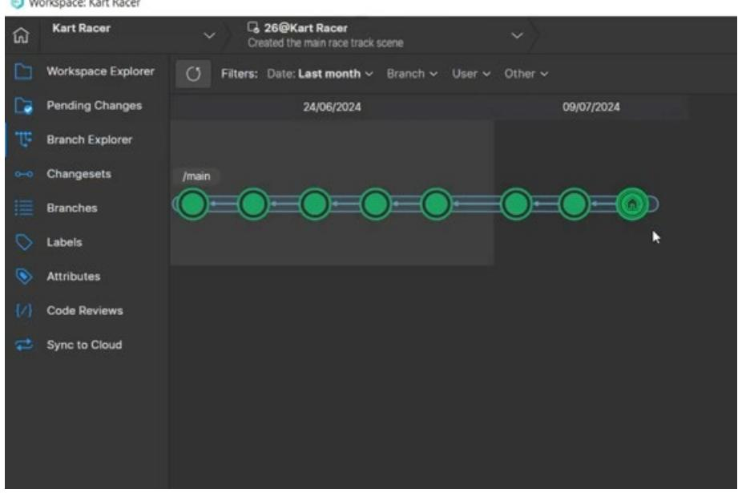

UVCS is the full software.

## <span id="page-70-0"></span>Using Gluon

As explained in the section that introduces UVCS, Gluon is a slim client designed specifically with artists in mind. It allows you to pick only the files that you're going to work on and check them out from the server, locking them from being modified by anyone else. Once you complete your work, you check the files back in. The Gluon GUI removes the more complex concepts that work better for programmers than for less technical users.

Open Gluon from the installed Unity DevOps Version Control applications.


The Gluon desktop app can be found from your installed Unity DevOps software.

It will prompt you to change from full mode to partial mode, the mode which Gluon runs in.

This warning allows you to change to a partial mode when working in Gluon by clicking **Run an update**.

Inside Unity, a **Configure Gluon** button replaces the **branches** icon. This will open the Gluon app every time you click on it.

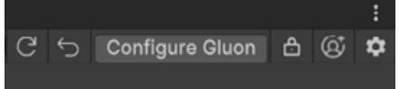

Team members using Gluon will now be able to open the Gluon app directly from the Version Control window in Unity.

You can enable the dark theme by clicking on the options button at the top right of the Gluon app.


In Gluon you can use the options drop down at the top right to enable the dark theme.

Gluon uses the main branch only, providing a visual, artist-friendly workspace. You can use Gluon to easily access the **Explore workspace** feature to upload and download files as needed.

In the Explore workspace section click the **Configure** button to make changes to the files on the repo.


Click the **Configure** button to make changes to files on the repo.

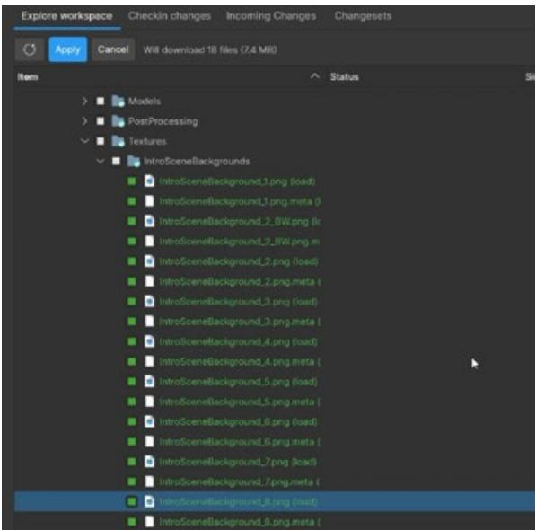

Select the files you need to download and click Apply in Gluon.

Click on the checkboxes next to files to either download or remove from the Explore workspace view. Files that will download to the Unity Editor turn green and files that you want to remove from Unity will turn red. Click **Apply** when done and then **Update workspace** so the files will be available in your version of Unity.

Even if you delete files inside of Gluon they only relate to this current changeset and any future changesets you create. The files will still be on the cloud as they will be referenced by previous changesets.

You can see the visual change of a texture that has numerous revisions by right-clicking on a revision in the options section on the right side of the Gluon app and selecting **Diff with previous revision**.

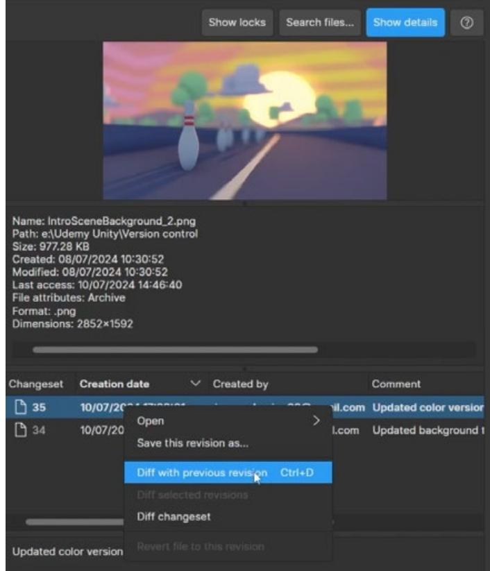

See a visual change between revisions by selecting **Diff with previous revision**.

This will show the differences between the previous revision and the current one.You have a few options in which to view this including swipe, which lets you drag a swipe slider along the image to view before and after.


Swipe option in the Diff viewer

<span id="page-73-0"></span>

## UVCS desktop app

The UVCS desktop app is the full, complete version control software suitable for team members who want access to branching. You can open it from the installed Unity DevOps Version Control applications.

If you used Gluon previously, it will prompt you to change from partial mode to full mode, the mode which UVCS runs in.

Change from partial mode to full mode for UVCS desktop version control software.

## Branches

Branches allow different team members to work on the same project independently of each other. For example, a team member might create a new feature on a separate branch, while other team members work on the main branch. Features can be things like creating the code for achievements, adding the mechanics for different types of pickups, etc.

When they complete their task they can merge their branches back into the main branch. All team members working on the project will then be able to update their workspace to incorporate all the work that has been done.

When you select the Branch Explorer within the Version Control window in the Unity Editor, it opens the UVCS app and takes you to the Branches section.

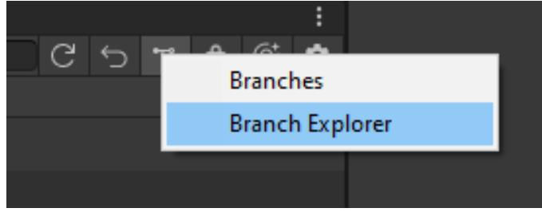

You can open the Branch Explorer section of the UVCS desktop app.

#### Each of the circles represents a changeset. Your current changeset has a house icon.


Right-click on a changeset and choose **Create branch from this changeset.**

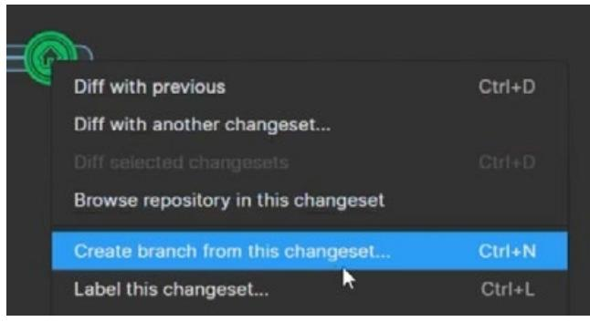

The Create a branch from a changeset option

You will now be working on a separate branch. Any changes made by team members on the main branch or other feature branches will not be sent to you. This reduces the risk of someone else's changes conflicting with your progress. You can update their changes later after merging.

Branches can have multiple changesets marked by circles just like the main branch.

When you complete your work on the branch you can merge your branch back to the main one by right-clicking and choosing **Merge from this changeset to…**.


Merge a branch back into another branch such as Main.

#### It will display available branches. Select the branch you want to merge to.

| Available Unity VCS branches                                                |                 |               | ×                   |
|-----------------------------------------------------------------------------|-----------------|---------------|---------------------|
| Available Unity VCS branches<br>Please select a branch from the list below: |                 |               |                     |
| 0                                                                           |                 |               | O Filter            |
| Name                                                                        | 2<br>Repository | Created by    | Creation date       |
| 80 /main                                                                    | Kart Racer      | Dave@mail.com | 24/06/2024 12:45:   |
| 2 /main/Feature 1 - Nitro boost                                             | Kart Racer      | Dave@mail.com | 09/07/2024 17:05 :: |
|                                                                             |                 |               | Cancel<br>OK<br>-   |

Available branches to merge to

<span id="page-76-0"></span>

This opens the merge section and shows if there are any conflicts. If there are no conflicts, click the **Check in merge** button.


UVCS checks all files on your branch for any conflicts with the main branch.

If someone on the main branch has made changes to the same file or files that you have, this might cause conflicts when trying to merge.

## Handling conflicts

A script or a scene file might be changed by two or more people on different branches. Trying to merge them together will trigger a merge conflict.

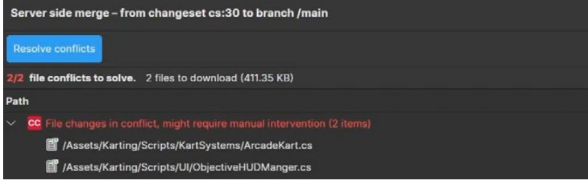

Two conflicts have been identified showing the files containing the conflicts.

Right-click on the files that have conflicts to show the differences and then decide if you want to keep or remove the changes.


Right-click menu showing the options available to handle a merge conflict


With a script you can choose **Diff source with destination**. This will open the Diff viewer so you can see how your file is different to the one on the branch you want to merge with.

| Differences .                    |                                                                                                                                                                                              |     |   |                                                                                                                                                                                                                              |
|----------------------------------|----------------------------------------------------------------------------------------------------------------------------------------------------------------------------------------------|-----|---|------------------------------------------------------------------------------------------------------------------------------------------------------------------------------------------------------------------------------|
| Text diff                        | Semantic diff                                                                                                                                                                                | (1) | O | 0<br>0<br>Current: 1/2                                                                                                                                                                                                       |
|                                  | es-30                                                                                                                                                                                        | I   |   | cs:28                                                                                                                                                                                                                        |
| 11<br>12<br>13<br>14<br>15<br>16 | [Tooltip("Prefab for the primary objectives")]<br>public PoolObjectDef secondaryObjectivePrefab;<br>Dictionary@bjective, ObjectiveToast> m_ObjectivesDictionary;<br>public Text carPosition; |     |   | 11<br>[Tooltip("Prefab for the primary objectives")]<br>public PoolObjectDef secondaryObjectivePrefab;<br>12<br>13<br>14<br>Dictionary < Objective , ObjectiveToast> = ObjectivesDic<br>15<br>16<br>public Text carPosition; |
| 17                               | private int carpos = 1;                                                                                                                                                                      |     |   | 17<br>public Text nitroPomer;                                                                                                                                                                                                |
| 18<br>19<br>20<br>21<br>22       | void Amake()<br>= ObjectivesDictionary = new Dictionary@Djective, ObjectiveToast>                                                                                                            |     |   | 18<br>19<br>void Amake()<br>20<br>21<br>= ObjectivesDictionary = new Dictionary<objective<br>22                                                                                                                              |
| 23<br>24<br>25<br>26             | carPosition.text = carPos. ToString();<br>public void RegisterObjective(Objective objective)                                                                                                 |     |   | 23<br>public volo RegisterObjective(Objective objective)<br>24<br>25<br>26<br>objective.onUpdateObjective += OmUpdateObjective;                                                                                              |

The Diff viewer shows the differences in the code between your file and the one on the branch you want to merge with.

This can help you to decide whether to overwrite the file on the other branch with your file. To do this choose **Merge keeping source changes**:

Or you can discard your changes and keep the original file on the other branch. To do this choose **Merge keeping destination changes**:

Finally, you can choose **Merge selected files** and UVCS will merge the two files together attempting to keep both sets of changes, although you should check the script after the merge to ensure it has done this correctly:

The Branch Explorer will now show which changesets have inherited merges from other branches.


Branch merged back into Main

<span id="page-78-0"></span>You can also right-click on any of the previous changesets and choose **Switch workspace to this changeset** to revert back to that point. This may be necessary if you added items or scripts that disrupted the game or caused issues.

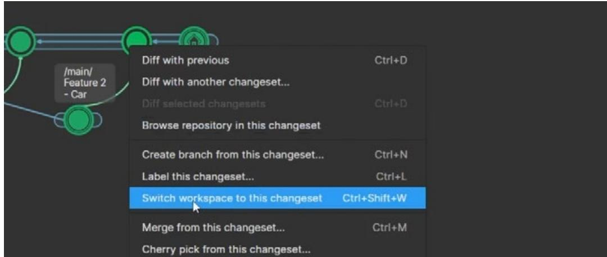

You can switch back to any previous changeset by right-clicking on the changeset of choice.

Changesets that cause serious errors or bugs can be deleted. These should not have any changesets leading forward from them, or labels or sub branches.

Right-click on a changeset with errors and go to **Advanced options > Delete changeset**.

| New code review for this changeset |                                                                    |
|------------------------------------|--------------------------------------------------------------------|
| Go to parent changeset             |                                                                    |
| Advanced options                   | Move from this changeset to a different branch<br>Delete changeset |

Delete a changeset from the right-click menu.

## Merge rules

A good idea is to implement merge rules to prevent merge conflicts from disrupting your team's workflow. This can be used in larger teams where team managers want to approve a branch before allowing it to be merged into the main branch. This prevents introducing errors into the main workflow.

Log into the Unity Cloud dashboard, go to **settings**, then **Merge rules**.

| 0<br>Overview                                                                | Unity Version Control > Settings > > Merge Rules                                                               |  |  |
|------------------------------------------------------------------------------|----------------------------------------------------------------------------------------------------------------|--|--|
| 68<br>Explore repositories<br>್ಕೆ<br>Version Control -<br>UVCS organizations | Organization settings<br>←                                                                                     |  |  |
| Or select organization<br>0<br>V                                             | Lock Rules<br>Network Allow Li<br>Integrations<br>Merge Rules<br>Mergebots<br>>                                |  |  |
| Repositories<br>Seats<br>User groups                                         | Merge rules<br>+ New merge rule<br>Merge Rules define conditions that branches must meet in order to be merged |  |  |
| Usage reporting<br>Settings                                                  | into other branches. Show more                                                                                 |  |  |
| િત<br>Build Automation -<br>Build history                                    |                                                                                                                |  |  |

Create a new merge rule from the Unity Cloud settings.

Click the **New merge rule** button and select from one of the four options. **Only allow merge if reviewed** will ensure that a merge can only take place after being reviewed and approved by other team members, or team managers.

You can also apply this to all repos if you have multiple that you are working on, or specify a specific repo from the drop down list.

| ← New Merge Rule                                                            | Enable rule<br>Cancel Save rule                                                                                                                                                                                                                                                                                                                                                                                                                                                                                 |
|-----------------------------------------------------------------------------|-----------------------------------------------------------------------------------------------------------------------------------------------------------------------------------------------------------------------------------------------------------------------------------------------------------------------------------------------------------------------------------------------------------------------------------------------------------------------------------------------------------------|
| Merge condition<br>Condition will apply to the<br>repositories you specify. | Only allow merge if reviewed<br>0<br>This rule will only accept merges whose source branches have an<br>approved review.<br>Restrict merge to branch<br>This rule will only accept merges if the source branch matches the rule<br>definition.<br>Only allow merges from parent<br>This rule will reject merges unless the source branch is the parent<br>branch, too.<br>Only allow merges from children<br>This rule will reject merges unless the source branch is a direct child of<br>the destination one. |
|                                                                             | Apply condition to these repositories:<br>Repositories<br>All repositories<br>P                                                                                                                                                                                                                                                                                                                                                                                                                                 |

The option **Only allow merge if reviewed** requires other team members to review your branch before merge.

Specify which branches you would like the merge rules to apply to. It needs a source branch, which is the branch you are working on, and a destination branch, the branch you want to merge to. Click the **Save rule** button and it will now be active. At any point you can disable or delete a rule from the Unity Cloud.

| Allow merge from this branch(es)<br>Branch pattern<br>Development<br>D |
|------------------------------------------------------------------------|
| Use * to specify patterns. e.g. main®<br>+ Add branch pattern          |
| Attributes (1)<br>+ Add attributes                                     |
| Allow merge into this branch(es)                                       |
| main<br>D                                                              |
| Use * to specify patterns. e.g. main*<br>+ Add branch pattern          |
| Attributes (1)<br>+ Add attributes                                     |
|                                                                        |

Include which branches the merge rule will apply to.

Team members wanting to merge their branch will have to request a branch review.

Go to the Branches section and right-click on the branch you want to merge. Choose the option **New code review for this branch.**

| Workspace Explorer              | O<br>Filters: Date v<br>Branch v<br>User v                      |                        |
|---------------------------------|-----------------------------------------------------------------|------------------------|
| 10<br>Pending Changes           | A<br>Name                                                       | Repository             |
| -16<br>Branch Explorer          | 2<br>/main                                                      | Branching Strategies   |
|                                 | /main/Development                                               | Branching Strategies   |
| Changesets<br>0-0               | /main/Development/Feature - animated cut &                      | Branching Strategies   |
| Branches                        | /main/Development/Feature - animated cut s                      | Branching Strategies   |
| C<br>Labels                     | 8<br>Main Maualammant /Cantura - Dialuna<br>Create child branch | Dennahing Ctrategies   |
|                                 |                                                                 | Ctrl+N<br>Ctrl+Shift+W |
| 0<br>Attributes                 | Switch workspace to this branch                                 |                        |
| 13<br>Code Reviews              | Merge from this branch                                          | Ctrl+M                 |
| t                               | Merge from this branch to                                       |                        |
| Sync to Cloud                   | Advanced merge                                                  | >                      |
| 20<br>Merge                     | Diff branch                                                     | Ctrl+D                 |
|                                 | Diff with another branch                                        |                        |
|                                 | View changesets in this branch                                  |                        |
|                                 | Push/Pull                                                       | >                      |
|                                 | Rename                                                          | E2                     |
|                                 | Delete                                                          | Delete                 |
| New code review for this braych |                                                                 |                        |
|                                 | Create top-level branch                                         |                        |

Request a code review for a branch you want to merge.

This will contain all the files that have been changed over the course of the entire branch.

Click on **conversations** to leave a message and invite other team members to review your work. Note that each team member must review the branch before you can merge, so ensure to include only the relevant people. They will then receive an email message to review your code.

|                                                    | Add description |
|----------------------------------------------------|-----------------|
| Select user or group                               | ×               |
| Please select a user or group from the list below: |                 |
| Both<br>Users<br>Groups                            | Q Filter        |
| Name                                               | A<br>Type       |
| ALL USERS                                          | Special group   |
| 82<br>Administrators                               | Group           |
| 13<br>Developers                                   | Group           |
| ਮ<br>Pete@mail.com                                 | User            |
| Dave@mail.com<br>ਸ                                 | User            |
|                                                    |                 |
|                                                    |                 |
| Selected user or group:                            |                 |
|                                                    |                 |
|                                                    |                 |
|                                                    | OK<br>Cancel    |
|                                                    |                 |

Choose individuals or groups members to review your branch.

Go to **Code Reviews** to see the progress of the review. Double-click to open it to see if any messages have been left for you.

| 1   | Workspace Explorer | O<br>Filters: Last activity ~ Created by √ Reviewer √ Status >                                                                                         |                            |
|-----|--------------------|--------------------------------------------------------------------------------------------------------------------------------------------------------|----------------------------|
| P   | Pending Changes    | Title                                                                                                                                                  | Status                     |
| 16  | Branch Explorer    | ( / ) Review of branch /main/Development/Feature - Pickups - Adding pickups to inc<br>{   Review of changeset 19 - Added the pickup items to the scene | O Under review<br>Reviewed |
| 0-0 | Changesets         | {/} Review of changeset 18 - Created a Pickups script                                                                                                  | @ Under review             |
|     | Branches           | { } Review of changeset 19 - Added the pickup items to the scene                                                                                       | O Under review             |
| 0   | Labels             |                                                                                                                                                        |                            |
| 0   | Attributes         |                                                                                                                                                        |                            |
| 11  | Code Reviews       |                                                                                                                                                        |                            |
| t   | Sync to Cloud      |                                                                                                                                                        |                            |
| 27  | Merge              |                                                                                                                                                        | A                          |

Code reviews show the ongoing progress of requested reviews.

The invited team members can then mark the branch as either **Rework required** or **Reviewed** and leave a message.


Reviewers can click the **Mark Review** button to mark it as rework required or reviewed.

Once the branch is reviewed it can then be merged. This adds extra security to your project.

You can also do the same procedure for code reviews on a specific changeset. This might be useful when you want other team members to review your code for bugs or issues, or perhaps suggest ways to improve the code.

To do this, right-click on a changeset and choose **New code review for this changeset**. You can then invite team members to check your files and give recommendations.


Requesting a code review for a changeset

<span id="page-83-0"></span>You can also add labels to a changeset. This might be useful if the changeset is an approved version e.g., version 1.0, or if it's a stable changeset and can be used for branching.

Right-click on the changeset and choose **Label this changeset**. Labels prevent the changeset from being deleted. You can remove a label from the labels section if necessary.


Label a changeset from the right-click menu. Labels give other users important information about this changeset.

## Locking files

Locking a file while you are working on it can prevent major merge conflicts. This file will then be locked on the cloud, preventing other team members from making changes to it while it's locked (they can still access the file in a read-only format). Once the file is checked back in, the lock is removed and other team members can make changes to it.

Locks are not automatically applied. By default, when you save your progress in Unity, any files you are working on will be marked with a checkout icon.


A purple checkout icon appears on the file icon in Unity and also on everyone else's versions, letting them know that somebody is working on the file.

The checkout icon in a purple box is displayed on the file on every team member's computer.

You can manually checkout a file before you begin working on it. Click the **Checkout** button in the Inspector. Other team members will see that you are working on the file, however, this is not a file lock, so other team members can still make their own changes to the same file. This is not as effective as using file locking.


Checkout a file when you are making changes to warn other team members that you are working on it.

UVCS uses smart locks. This ensures that other team members who want to make changes to this file will be forced to use the latest revision of the file. This is important, as you may be working on a branch that is using an older version of that file. Smart locks checks all branches including the main to find the latest revision of this file and ensures you are working from that version and not an outdated older version.

To lock files, go into the Branch Explorer.

In the **Workspace Explorer** view find the file you want to lock, right-click on it and choose **Lock and checkout**. This only works as long as no other team member has checked the file out.

|     | 16J Workspace: Kart Racer |      |   |                                    |                                                   |   |            |              |   |               |     |
|-----|---------------------------|------|---|------------------------------------|---------------------------------------------------|---|------------|--------------|---|---------------|-----|
| 10  | Kart Racer                |      |   | 31@Kart Racer<br>Updated 3D models | >                                                 |   |            |              |   |               |     |
|     | Workspace Explorer        | 0    |   | Update workspace                   |                                                   |   |            |              |   |               |     |
|     | Pending Changes           | Item |   |                                    |                                                   | A | Status     |              |   | Size          | Dat |
|     | Branch Explorer           |      |   | IntroMenuSettings.lighting         |                                                   |   | Controlled |              |   | 1.78 KB 24/   |     |
| 0-0 | Changesets                |      |   |                                    | IntroMenuSettings.lighting.meta                   |   | Controlled |              |   | 400 bytes 24/ |     |
|     |                           |      |   | LoseScene.unity                    |                                                   |   | Controlled |              |   | 35.67 KB 24/  |     |
|     | Branches                  |      |   | LoseScene.unity.meta               |                                                   |   | Controlled |              |   | 344 bytes 24/ |     |
| 1   | Labels                    |      |   | LoseSceneSettings.lighting         |                                                   |   | Controlled |              |   | 1.80 KB 24/   |     |
|     |                           |      |   |                                    | LoseSceneSettings.lighting.meta                   |   | Controlled |              |   | 400 bytes 24/ |     |
| 0   | Attributes                |      |   | MainScene.ur                       |                                                   |   |            |              |   | 786.02 KB 24/ |     |
| 111 | Code Reviews              |      |   | MainScene.ur                       | Open                                              |   |            |              |   | 344 bytes 24/ |     |
|     |                           |      |   | 1<br>MainSceneSe                   | Diff with previous revision                       |   |            | Ctrl+D       |   | 1.80 KB 24/   |     |
| 1   | Sync to Cloud             |      |   | 2<br>MainSceneSe                   | Add to source control                             |   |            | Ctrl+Shift+A |   | 400 bytes 24/ |     |
|     |                           |      |   | MLTraining.m                       | Add directory tree to source control Ctrl+Shift+R |   |            |              |   | 172 bytes 24/ |     |
|     |                           |      |   | RaceTrackMa                        | Check in                                          |   |            | Ctrl+1       |   | 786.76 KB 09/ |     |
|     |                           |      |   | 1<br>RaceTrackMa                   | Checkout                                          |   |            | Ctrl+0       |   | 155 bytes 09/ |     |
|     |                           |      |   | WinScene.uni                       | Lock and checkout                                 |   |            |              |   | 35.67 KB 24/  |     |
|     |                           |      |   | 1<br>WinScene.uni                  | Undo checkout                                     |   |            | Ctri-Z       |   | 343 bytes 24/ |     |
|     |                           |      |   | 11<br>WinSceneSet                  | Change revision type                              |   |            |              |   | 1.80 KB 24/   |     |
|     |                           |      |   | WinSceneSet                        | Add to ignored list                               |   |            |              |   | 399 bytes 24/ |     |
|     |                           |      | > | ScriptableObject                   | Add to cloaked list                               |   |            |              | > |               | 24/ |
|     |                           |      |   | Scripts                            | Add to hidden changes list                        |   |            |              | > |               | 09/ |

Lock files from the UVCS desktop app in the Workspace Explorer.


You can define locking rules for this type of file. To just lock this specific file, choose **Lock only** (The fourth option in the list below).

| Add lock rule and checkout                                                                         | × |
|----------------------------------------------------------------------------------------------------|---|
| Add lock rule and checkout                                                                         |   |
| To lock a file, you must first configure a lock rule.                                              |   |
| Choose one of the following options to configure which files are automatically locked on checkout. |   |
| · Lock files matching *. unity                                                                     |   |
| Lock any file with name 'OasisScene.unity'                                                         |   |
| Lock all files in directory<br>/Assets/Scenes                                                      |   |
| Lock only<br>/Assets/Scenes/OasisScene.unity                                                       |   |
| Let me edit the lock rule                                                                          |   |
| * unity                                                                                            |   |
| Click here to learn how to configure lock rules                                                    |   |
|                                                                                                    |   |
| Cancel<br>OK                                                                                       |   |
|                                                                                                    |   |

Define rules for locking this file or filetype.

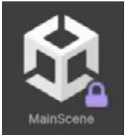

The file will now display a purple lock icon in each team member's version of Unity, letting others know that you have locked the file for editing.

The purple lock icon shows other team members that this file is locked.

Team members can still view the file as read-only, but cannot make any changes until it is checked back in by you.

After completing your changes, check in the file and it removes the lock.

<span id="page-86-0"></span>

Team members with admin status can log into the cloud and go to **Repositories** and then **File locks** to manually remove a lock.

| Asset Manager          |                        |                |             |                                                                                                                           |               |                        | Star    | Settings                           |
|------------------------|------------------------|----------------|-------------|---------------------------------------------------------------------------------------------------------------------------|---------------|------------------------|---------|------------------------------------|
| File explorer          | A File locks           | @ Code reviews | P Branches  | C Labels<br>· Changesets                                                                                                  | O Attributes  |                        |         |                                    |
|                        |                        |                |             |                                                                                                                           |               |                        |         | Tutorial: How to use Smart locks C |
| File Locks             |                        |                |             |                                                                                                                           |               |                        |         |                                    |
|                        |                        |                |             | These files were locked upon checkout to prevent merge conflict. You can manage or configure lock rates in your settings. |               |                        |         |                                    |
| Q<br>Search file locks |                        |                |             |                                                                                                                           |               | Search<br>O Selections |         | Remove locks                       |
| P Lock branch >        | Q Lock owner v         | B Date V       |             |                                                                                                                           |               |                        |         |                                    |
| <br>Rem                |                        | Lock status    | Lock branch | Lock date ↓                                                                                                               | Lock owner    |                        |         |                                    |
| >                      | /Assets/Karting/Scenes | Locked         | /main       | 6/24/24, 5:59 PM                                                                                                          | Dave@mail.com |                        | Release | Remove                             |
|                        |                        |                |             |                                                                                                                           |               |                        |         |                                    |

Removing file locks on the Cloud

### Monitoring or removing a repository

You can monitor the Repository in the desktop app. Click on the **Home** icon at the top left and select the top icon to view the current Repository.

From here you can download the entire repo to your computer, open it in the desktop app, rename it, or delete it. Repos stay on the cloud for a further 10 days before being deleted, in case you change your mind. You can retrieve a deleted repo by choosing **Undelete**.

|       | Unity DevOps Version Control |                |    |                                                                                  |                                |              |     |     | -                                                                | D     | × |
|-------|------------------------------|----------------|----|----------------------------------------------------------------------------------|--------------------------------|--------------|-----|-----|------------------------------------------------------------------|-------|---|
|       |                              |                |    |                                                                                  |                                |              |     |     |                                                                  |       |   |
| 0 0 1 | Dave@mail.com cloud<br>>     | CMT@cloud<br>V |    |                                                                                  |                                |              |     |     |                                                                  |       |   |
|       | Repositories +               | Q Fiter        | હિ | C Kart Racer                                                                     | Download repository Show locks |              | B 1 | ប៉ា | Q Search files<br>ne                                             |       |   |
|       | Kart Racer                   |                |    | Download this repository<br>Assets<br>2<br>Open this repository<br>Packages<br>2 |                                |              |     |     |                                                                  |       |   |
|       | Kart Racer                   |                |    | > ProjectSettings<br>Rename<br>Delete                                            |                                | F2<br>Delete |     |     |                                                                  |       |   |
|       | RPG Game                     |                |    |                                                                                  |                                |              |     |     | Undelete                                                         |       |   |
|       |                              |                |    |                                                                                  |                                |              |     |     | Create new sync view (push/pull) Ctrl+C                          |       |   |
|       |                              |                |    |                                                                                  |                                |              |     |     | Path permissions<br>Permissions<br>Repository server permissions | Cul+P |   |
|       |                              |                |    |                                                                                  |                                |              |     |     |                                                                  |       |   |

Downloading, deleting, or undeleting a repo


You can view any repositories on the Cloud in the DevOps section. This will show you the actual storage used, which should be much smaller than the project on your computer.

Here you can also add or remove repositories. The DevOps section will give you more

information regarding your DevOps account including usage reports and settings.

| Asset Manager               |            |                 | Star       | Settings    |   |
|-----------------------------|------------|-----------------|------------|-------------|---|
| File explorer               | File locks | Code reviews    | & Branches | -0-         | > |
| 17<br>Q<br>Search           |            | 8 /main v       |            | Open in app |   |
| Assets                      |            | 1<br>Name       |            | Changeset   |   |
| Packages<br>ProjectSettings |            | Assets          | CS:9       |             |   |
|                             |            | Packages        | CS:3       |             |   |
|                             |            | ProjectSettings | CS:5       |             |   |
|                             |            |                 |            |             | A |

View the storage of your repositories by logging into the Unity Cloud DevOps section.

You can view your current data usage by checking the **Overview** section in the cloud. This will show your monthly GB hours. See the [Unity Cloud pricing plans page](https://unity.com/products/compare-plans/unity-cloud) for more information or sign into the Unity Cloud dashboard and go to the [DevOps dashboard "About" page](https://cloud.unity.com/home/organizations/default/devops/about).

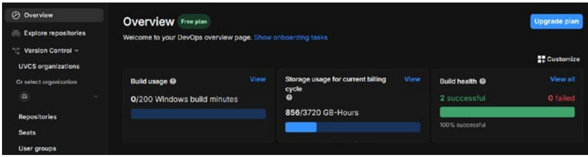

The Overview section on the Cloud shows your monthly storage.

<span id="page-88-0"></span>

## Unity support

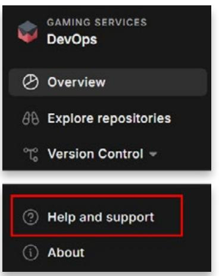

In the DevOps section of the Unity Cloud dashboard, click on **Help and support**.

From the cloud dashboard, click on the **Help and support** button to view FAQs, forums and blog posts, or generate a support ticket for help with issues that you might encounter.

You will also find sample repo projects in the **DevOps** category, under **Explore repositories**. You can download these public repos to your computer as template projects to work on.

| Overview                | Explore Unity repositories                                                                               |                |                    |                             |
|-------------------------|----------------------------------------------------------------------------------------------------------|----------------|--------------------|-----------------------------|
| 88 Explore repositories |                                                                                                          |                |                    |                             |
| Version Control -       | Unity Samples Alpha                                                                                      |                |                    | Tutorial: Use Unity Samples |
| UVCS organizations      |                                                                                                          |                |                    |                             |
| Or select organization  | All repositories<br>Starred by me                                                                        |                |                    |                             |
| 0<br>2                  |                                                                                                          |                |                    |                             |
| Repositories            |                                                                                                          |                | Q Search by name   | Search                      |
| Seats                   | Name                                                                                                     | Stars          | 2<br>Last activity | Size                        |
| User groups             |                                                                                                          |                |                    |                             |
| Usage reporting         | Megacity-Metro<br>Experience multiplayer mechanics like interpolatio                                     | 53<br>46 stars | 6 days ago         | 2.12 GB                     |
| Settings                | n, prediction and lag compensation in this 128+                                                          |                |                    |                             |
| Build Automation -      | 2d-game-match3                                                                                           |                |                    |                             |
| Build history           | Gem Hunter Match is an official Unity sample that<br>shows how to make static objects and casual ga      | 40 stars       | August 23, 2024    | 75.96 MB                    |
| Configurations          |                                                                                                          |                |                    |                             |
| Service updates         | UGS-use-case-samples                                                                                     | 57<br>20 stars | July 31, 2024      | 8.81 MB                     |
| Settings                | This Unity Gaming Services (UGS) Use Cases proj<br>ect contains a collection of samples designed to      |                |                    |                             |
| Unity Cloud Drive       | 2d-game-farming                                                                                          |                |                    |                             |
| N Usage                 | Happy Harvest is an official Unity sample project t<br>hat showcases the capabilities of the native 2D t | 8<br>38 stars  | July 19, 2024      | 44.8 MB                     |
|                         |                                                                                                          |                |                    |                             |

Some of the public sample repositories you can download

## <span id="page-89-0"></span>Build the foundation for your live game

Outside of devops Unity also provides a complete ecosystem for managing live games with [Unity Gaming Services](https://unity.com/solutions/gaming-services) (UGS) that can help you acquire and connect your players at scale across multiple platforms, and manage your back end infrastructure. Here is a brief overview of some of the services.

## Unity Gaming Services

#### **Multiplayer**


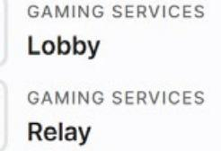

Unity offers two networking stacks: Netcode for GameObjects and Netcode for Entities, plus multiplayer tools from Unity Gaming Services like Game Server Hosting and Vivox Voice Chat. You can build within Unity's ecosystem, or mix and match your preferred tools and services depending on your needs.

[Learn more about Unity Multiplayer](https://unity.com/solutions/multiplayer)

<span id="page-90-0"></span>

#### **Community**


Access a suite of community gaming services for games of all sizes, from a two-person project to millions of simultaneous users, with engine-agnostic voice and text chat. Add social elements like friends and leaderboards to your game to increase player engagement and

#### [Learn more about Unity game Community solutions](https://unity.com/solutions/community)

#### **Accounts**


Unity Authentication and Unity Player Accounts offer you the flexibility to handle your players' identities by providing mix-and-match features suited to your game and target platforms.

[Learn more about Unity Authentication and Player Accounts](https://unity.com/solutions/accounts).

#### **Content management**


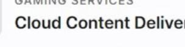


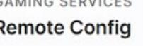

Cloud Save makes it efficient to create a better player experience where players can store game data to the cloud. With Cloud Content Delivery, you can build and release game updates with powerful asset management and content delivery via the cloud and the first 50 GB of bandwidth are free every month.

The Remote Config service makes it efficient to run A/B experiments that target specific player segments by using Game Overrides. You can change your game's difficulty, ad frequency, or general attributes for all players or a subset of players before making any code changes or app updates.

[Learn more about Unity Content Management](https://unity.com/solutions/content-management)


<span id="page-91-0"></span>

#### **Crash reporting**

The Cloud Diagnostics service can help improve stability and reduce churn. It provides realtime crash data so your team can fix bugs faster and help prevent player churn. Unity offers crash and error reporting solutions that are free to start using and can be scaled up as your project grows.

[Learn more about Unity Cloud Diagnostics](https://unity.com/solutions/crash-reporting)

#### **Game economy**


Game Economy services provide you with features to build a customized in-game economy and offer your players seamless purchases, currency conversion, inventory management, and more. Once you have integrated a fully-featured economy into your game you can manage it efficiently through a streamlined dashboard.

[Learn more about Unity's Economy service](https://unity.com/products/economy)

#### **Engagement and analytics**


Understand your game and engage your players. These services can help you efficiently refine your game experience, retain players, and grow your game.

[Learn more about Unity Analytics](https://unity.com/solutions/engage-players)

<span id="page-92-0"></span>

## Unity Grow

#### **User acquisition**


Unity's suite of user acquisition services can help your game acquire the right mobile users. Tap into the extensive global supply of Unity Ads to optimize your campaign goals for return on ad spend (ROAS), retention, or scale.

[Learn about Unity user acquisition](https://unity.com/solutions/user-acquisition)

#### **Monetization**

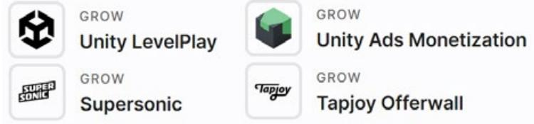

Reach your app's full revenue potential with the most advanced technology and robust toolset in the market for monetizing your game effectively.

[Learn about Unity monetization](https://unity.com/solutions/app-monetization)

## <span id="page-93-0"></span>Conclusion

Hopefully this guide will help you to feel more comfortable working with version control as part of a team in Unity. Even if you're working on a solo project, the principles of organizing your project and using version control can be really useful.

The biggest takeaway is the importance of clear team communication and agreement on tools, processes, structure and code style. As a team, you need to agree on your guidelines: how you should structure your project, which version control system to use, and how your workflow in that system looks. Then, when you start integrating other tools such as JIRA, GitLab, build tools, or automated testing, the work you've already done structuring your project and workflow will really come into its own.

Finally, check out the following resources to find a wealth of information on the various version control systems discussed in the book, plus more tips on setting up your Unity project for success.

## <span id="page-94-0"></span>Additional resources

- [Eight factors to consider when choosing a version control system](https://blog.unity.com/technology/eight-factors-to-consider-when-choosing-a-version-control-system?utm_source=demand-gen&utm_medium=PDF&utm_campaign=asset-links-gmg-achieve-quality&utm_content=version-control-and-project-organization-ebook)
- [Introduction to version control, Unite Now 2020](https://youtu.be/ISW2nS_v3Ic)
- [Git Apprentice, by Chris Belanger and Bhagat Singh](https://www.raywenderlich.com/books/git-apprentice/v2.0/)
- [Version Control for Games with Unity's Plastic SCM](https://youtu.be/PjPK6hxGUFU)
- [Plastic SCM product documentation](https://docs.plasticscm.com/book/)
- [Mergebot in Plastic SCM](https://www.youtube.com/watch?v=WJTKSUgj8pY)
- [Unity open project with version control](https://github.com/UnityTechnologies/open-project-1)
- [How KO\\_OP uses Plastic SCM to accelerate production](https://create.unity.com/ko-op-plastic-scm-case-study)
- [The hidden productivity costs disrupting your release timelines](https://create.unity.com/hidden-productivity-costs-e-book)

#### **Perforce setup**

- [How to Configure Helix Core and Game Engine](https://www.perforce.com/products/helix-core/configure-helix-core-game-engine)
- [Helix Core documentation](https://www.perforce.com/products/helix-core/learning-resources)


[unity.com](https://unity.com/)